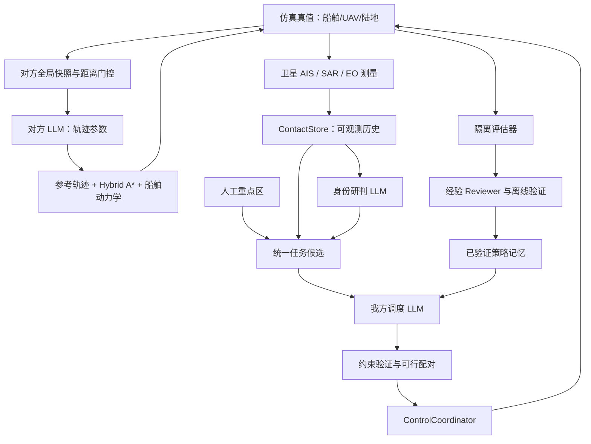

# 混杂海上目标、双侧 LLM、人类意图与策略自演进设计

> 术语已按 2026-09-16 统一：分类使用 I 类船舶/II 类船舶，运行时值使用 `type_i`/`type_ii`。

状态：待用户审阅。本文及配套实施方案不构成实施授权。

配套文档：[实施方案](../plans/2026-09-14-mixed-maritime-llm-implementation-plan.md)。执行者为 Luna Max；本文是数据和行为契约的唯一来源。日期：2026-09-14。

## 1. 需求边界与审阅约定

### 1.1 已确认需求

| ID | 必须实现的行为 |
|---|---|
| R1 | `initial_ship_count=N` 决定初始化通用船舶总数，取消船型和编队主导的生成逻辑。 |
| R2 | I 类船舶是干扰目标，始终广播民用 AIS，规则航行，不因 UAV 接近改变行为。 |
| R3 | 目标船舶可静默或广播伪装民用 AIS；AIS 通过卫星全局可接收；AIS 类型、位置一致性和静默均不能直接决定身份。 |
| R4 | 一个对方 LLM 集中控制目标船舶；距离门控决定哪些船舶可以逃逸；输出轨迹参数，不输出航路点。 |
| R5 | 船舶导航复用现有 Hybrid A*，适配船舶运动和陆地障碍。 |
| R6 | 我方 LLM 统一调度搜索、递进核查和目标跟踪；使用历史轨迹及 UAV 接近过程判断身份。 |
| R7 | I 类船舶判定后解除任务，UAV 回到可调派资源序列；避免重复 AIS 导致重复核查。 |
| R8 | 地图人工框选重点区域，人类意图持续进入候选生成、LLM 输入和资源调度。 |
| R9 | 增加自演进，通过任务效果改进我方策略；具体采用下面的受验证策略记忆方案，待审阅确认。 |
| R10 | 文档先行，用户审阅通过后才实施。 |

### 1.2 建议默认值，不冒充用户已决定

以下均为首版可执行提案：目标数量由独立 `target_ship_count` 指定；初始 AIS 随机后整回合固定；不增加 AIS 开关策略或虚假坐标攻击；正常船舶沿预生成海上通行路线驶离；重点区不强制中断正在执行的普通任务；AIS 初次核查允许中断普通搜索；对方超阈值解除采用滞回；策略自演进只影响我方 Prompt，不训练权重、不改代码、不改变硬约束。

用户可以在审阅时修改这些提案。实现者不得把提案扩展成船舶攻击、武器、复杂多目标跟踪滤波器、通用技能市场或新的训练平台。

## 2. 现有代码证据与必须移除的冲突

| 当前位置 | 当前行为 | 新设计要求 |
|---|---|---|
| `src/env/simulation.py::_create_ships` | 随机 3–5 艘、编队、航母/驱逐舰 | 精确 N 艘独立通用船；ID 与身份无关联 |
| `src/env/ship.py::set_tracked` | 被我方跟踪即逃逸，I 类船舶也触发；解除不清 `_evasive` | 用物理距离状态机替代，禁止跟踪状态触发逃逸 |
| `src/env/ais_signal.py` | 军用伪装带大位置偏差 | 伪装与民用 AIS 使用相同报文分布，不泄露身份 |
| `src/utils/ais_discriminator.py` | 静默即军用、位置一致即民用 | 保留测量几何工具；删除运行时身份判定依赖 |
| `simulation.py::_handle_detection` | 发现立即抢占搜索、整组建立跟踪 | 只建立/更新接触并触发调度；任务安装只能来自有效 LLM 决策 |
| `simulation.py::_sync_state_from_entities` | `_group_center` 真值更新跟踪区 | 改为接触观测/有限预测；禁止真值刷新调度状态 |
| `simulation.py::_process_ais_tracking` | 多点位置中位数后做 AIS 判别 | 带时间的独立 AIS/EO 轨迹、递进试验和 LLM 研判 |
| `src/control/heuristic/task_flow.py` | `target_found` 自动转跟踪；释放可恢复旧搜索 | 新模式发现不自动转任务；I 类船舶释放先回资源池，后续由全局调度决定 |
| `task_allocator.py`, `llm_client.py` | LLM 只选新增矩形，硬性尽量填满 SAR | 统一候选任务选择，搜索不能耗尽核查名额 |
| `candidate_extractor.py` | 已完成搜索可能被生命周期任务持续保留 | 保留搜索基线，但释放、意图到期、失跟的任务生命周期统一核对 |
| `configs/llm_params.yaml` | 两个相同 `cycles` 键；角色硬绑定 LongCat | 保留当前 LongCat-2.0 默认，去重配置、增加角色绑定、严格解析 |
| `src/vis/backend/server.py` | CORS 仅 GET；共享 StateManager | 意图写操作通过命令队列进入仿真线程，扩展必要方法 |

当前控制为 `ControlCoordinator` + ownership generation + 安全包络，必须继续使用；不得在 LLM 回调里直接写 UAV 运动状态。现有导航是 `AStarNavigator.plan_grid(start, goals, obstacle_mask, r_min, planning_map_version)`，不是普通点网格 A*。当前主步长为 1 仿真分钟，API 等待不推进仿真时间。

## 3. 架构与数据可见性



“双方全局视角”的含义：我方汇总所有 UAV 观测和卫星 AIS，对方统一获得所有己方船舶和 UAV 运动状态；不是我方直接知道静默船舶或真实身份。对方虽然能看全局 UAV，非触发目标依然不能使用逃逸参数。

| 数据 | 我方调度/研判 | 对方 LLM | 评估器 |
|---|---|---|---|
| 己方 UAV 位姿、任务、油量 | 是 | 位姿/速度；不含任务、Prompt、油量 | 是 |
| 船舶真实位置与身份 | 否 | 是，仅控制目标船舶 | 是 |
| 卫星 AIS 与机载测量 | 是 | 可读取己方 AIS 状态 | 是 |
| 对方距离门控、参数、逃逸状态 | 否 | 是 | 是 |
| 人工重点区、我方策略记忆 | 是 | 否 | 是 |

UI 默认显示我方观测层；评估调试真值层须明确标注且不反馈到我方 Prompt。运行日志按 `blue/`、`red/`、`evaluation/` 隔离。真值身份只能用于回合结束评估和聚合经验，不允许在当前回合通过 Reviewer 泄露。

## 4. 配置与单位

全局时间为仿真分钟；公共坐标为连续格坐标；位置 `(col,row)`；矩形为半开区间 `[c0,c1)×[r0,r1)`；地图边界取配置，不写死 29/30/10。对外角度为度、控制器内部为弧度。`cells_per_min = knots * 1.852 / 60 / cell_size_km`。

以下为新增/替换配置的建议默认值，均须可验证、可写入 run manifest。

```yaml
# configs/ship.yaml（新模式使用统一类别比例，保留动力学字段）
population:
  total_count: 8
  type_i_ratio: 0.625
  type_ii_ratio: 0.375
type_ii_ais_on_probability: 0.5
speed_kn: 18.0
ais_update_interval_min: 1.0
ais_position_noise_cells: 0.05
max_turn_rate_deg_min: 12.0
yaw_time_constant_min: 2.5
heading_control_gain_per_min: 0.35
turn_speed_loss_fraction: 0.12
max_acceleration_kn_per_min: 2.0
detect_uav_radius_cells: 1.5
clear_uav_radius_cells: 2.2
clear_hold_min: 5.0
red_decision_cycle_min: 3.0
red_plan_valid_min: 3.0
speed_min_kn: 10.0
speed_max_kn: 24.0
heading_offset_max_deg: 90.0
zigzag_heading_max_deg: 35.0
zigzag_period_min_min: 4.0
zigzag_period_max_min: 20.0
min_evasion_heading_deg: 8.0
min_evasion_speed_delta_kn: 2.0
navigation_horizon_min: 8.0
integration_dt_min: 0.1
navigation_clearance_cells: 0.1

# configs/mission.yaml（新建）
contact:
  history_window_min: 120.0
  history_max_samples: 600
  stale_after_min: 5.0
  association_gate_cells: 0.5
  association_margin_cells: 0.2
  assessment_interval_min: 3.0
  min_valid_samples_per_phase: 4
  max_sample_gap_min: 2.0
  baseline_duration_min: 4.0
  near_duration_min: 5.0
  baseline_standoff_cells: 1.8
  near_standoff_cells: 1.2
  probe_timeout_min: 20.0
  approach_timeout_min: 120.0
  probe_retry_cooldown_min: 10.0
  assessment_confidence_min: 0.8
  type_i_recheck_cooldown_min: 60.0
  prompt_contact_limit: 20
  prompt_keypoints_per_contact: 12
intent:
  max_active_intents: 20
  default_valid_duration_min: 120.0
  default_revisit_interval_min: 20.0
  default_weight: 0.5
  candidate_limit: 20
  general_candidate_reserve: 2
  freshness_threshold: 0.7
  mutation_queue_limit: 100
scheduling:
  allow_probe_preempt_search: true
  allow_intent_preempt_search: false
  reassignment_cooldown_min: 5.0
  max_tasks_in_prompt: 40
evolution:
  enabled: true
  max_active_memories: 5
  max_memory_chars: 400
  min_support_episodes: 3
  candidate_generation_interval_episodes: 5
  validation_seeds: [101, 102, 103, 104, 105, 106, 107, 108, 109, 110]
  holdout_seeds: [201, 202, 203, 204, 205]
  repeats_per_seed: 3
  minimum_score_gain: 0.02
  maximum_component_regression: 0.02
```

配置校验：拒绝 bool 充当 int；`population.total_count` 为非负整数，`type_i_ratio + type_ii_ratio == 1`；概率 `[0,1]`；所有数值有限；时间/速度正；`clear_radius>detect_radius`；速度上下限有序，正常速度在范围内；`near_standoff<detect_radius<baseline_standoff`，baseline 不大于 EO 晴空有效范围；核查轨道还必须满足 UAV 转弯半径和真实航迹可达，配置通过不代表当前天气可达。核查超时大于两个观察阶段时长和至少一个主步长。重复 YAML 键报错。新配置未知字段报错，防止拼写错误被 `_dict_to_dataclass` 静默忽略。

LLM 角色：`decision_maker`（统一调度）、`contact_assessor`（身份）、`red_commander`（对方参数）、`reviewer`（已有态势摘要及离线经验，分不同任务 Prompt）。新增绑定默认仍为 LongCat-2.0，temperature=0.3、thinking=disabled；tokens 分别 4096/2048/4096/2048。Luna Max 是实施执行者，不是运行模型配置要求。所有真实运行走 API，契约测试可注入固定响应，不可将 fixture 成功统计为模型成功。

## 5. 核心数据契约

新类型集中放 `src/mission/contracts.py`，用标准库 dataclass、Literal；JSON 边界严格手工解析，复用后端已有 Pydantic 处理 HTTP 请求，避免新增依赖。下列定义是规范字段，JSON 中 tuple 转 array；禁止额外键、NaN、Infinity，所有对象带明确 schema 或由包含对象统一标识。

```python
from dataclasses import dataclass
from typing import Literal

Vec2 = tuple[float, float]
Rect = tuple[int, int, int, int]
VesselClass = Literal['unknown', 'type_ii', 'type_i']
ContactState = Literal['pending', 'queued', 'approaching', 'observing',
                       'tracking', 'cleared', 'lost', 'departed']

@dataclass(frozen=True)
class ObservationSample:
    sample_id: str
    contact_id: str
    observed_at_min: float
    source: Literal['ais', 'sar', 'eo']
    source_id: str  # AIS MMSI 或 UAV ID；不含物理船舶 ID
    position_cells: Vec2
    velocity_cells_min: Vec2 | None
    position_uncertainty_cells: float
    observer_position_cells: Vec2 | None  # AIS 为 None
    measured_range_cells: float | None
    navigation_context: Literal['open_water', 'near_land', 'unknown']

@dataclass(frozen=True)
class Assessment:
    assessment_id: str
    contact_id: str
    probe_id: str
    history_revision: int
    assessed_at_min: float
    vessel_class: VesselClass
    confidence: float
    evidence_sample_ids: tuple[str, ...]
    reasons: tuple[str, ...]
    alternative_explanations: tuple[str, ...]
    model_call_id: str

@dataclass(frozen=True)
class ContactSnapshot:
    contact_id: str
    revision: int
    state: ContactState
    vessel_class: VesselClass
    ais_mmsi: str | None
    first_seen_min: float
    last_seen_min: float
    estimated_position_cells: Vec2
    estimated_velocity_cells_min: Vec2 | None
    uncertainty_cells: float
    assigned_uav_id: str | None
    active_probe_id: str | None
    last_assessment: Assessment | None
    cleared_at_min: float | None
    next_probe_not_before_min: float
    samples: tuple[ObservationSample, ...]

@dataclass(frozen=True)
class ProbeSession:
    probe_id: str
    contact_id: str
    uav_id: str
    phase: Literal['baseline', 'closing', 'near', 'awaiting_assessment', 'finished']
    started_at_min: float
    baseline_started_at_min: float | None
    phase_started_at_min: float
    baseline_sample_ids: tuple[str, ...]
    near_sample_ids: tuple[str, ...]
    close_exposure_min: float
    completed_reason: str | None

@dataclass(frozen=True)
class Intent:
    intent_id: str
    revision: int
    label: str
    bbox: Rect
    mode: Literal['search_priority', 'maintain_freshness']
    priority: Literal['high', 'medium', 'low']
    weight: float
    created_at_min: float
    expires_at_min: float
    revisit_interval_min: float | None
    lifecycle: Literal['active', 'expired', 'cancelled']

@dataclass(frozen=True)
class TaskCandidate:
    task_id: str
    kind: Literal['search', 'probe', 'track']
    bbox: Rect | None
    contact_id: str | None
    intent_ids: tuple[str, ...]
    feasible_uav_ids: tuple[str, ...]
    eligible_since_min: float
    priority: Literal['high', 'medium', 'low']
    estimated_duration_min: float
    utility: float
    expected_information_gain: float

@dataclass(frozen=True)
class MissionSelection:
    schema_version: str  # mission-selection/v1
    snapshot_id: str
    selected_task_ids: tuple[str, ...]  # 有序，前者优先
    preempt_uav_ids: tuple[str, ...]
    defer_reason: str | None
    notes: str

@dataclass(frozen=True)
class RedMotionParameters:
    ship_id: str
    heading_offset_deg: float  # 相对固定正常航线切向，不逐步累加
    speed_kn: float
    zigzag_heading_deg: float  # 0 表示非蛇形的有效逃逸参数选择
    zigzag_period_min: float
    phase_deg: float

@dataclass(frozen=True)
class RedPlan:
    schema_version: str  # red-plan/v1
    snapshot_id: str
    valid_for_min: float
    commands: tuple[RedMotionParameters, ...]
    notes: str
```

运行时可变状态由各 Store 私有持有，外部只拿冻结快照。`ContactSnapshot` 不包含真值 ship ID、环境侧 vessel_class 真值、is_evading、LLM 参数。所有 `*_id` 由程序生成，模型仅引用已提供 ID；`Assessment` 中 assessment_id/time/call_id 由服务补充，不由模型自由填写。

### 5.1 ID、关联与历史

物理实体 `V0001` 等，身份使用独立 RNG 打乱，ID 不编码身份。接触 `C0001`、核查 `P0001`、任务 `Q0001`、意图 `I0001` 均按 episode 内独立序列生成。任务 ID 在候选有效期内稳定，不在每帧重新编号。

AIS MMSI 初始稳定且唯一，类型/名字都用同一民用模板；默认位置噪声与身份无关，避免“UNKNOWN”名称泄露。物理船到接触的关联仅允许评估器使用，传感器输出去掉物理 ID。

ContactStore：AIS 首先按 MMSI 更新；SAR/EO 按时间预测后的欧氏距离门控，与最近候选匹配，最近和次近距离差必须大于 association_margin；否则新建未关联接触并标记待复核，不借助真值消歧。连续两次无歧义关联才合并 AIS/视觉历史；保留 alias 映射和所有原 sample ID，不凭一次近距离合并。合并后统一任务占用，停止重复核查，记录 `contact_merged`；矛盾关联回退为独立接触，不改历史来源。

AIS 与 EO/SAR 分源保存，不将 AIS 点混入视觉轨迹拟合。velocity 缺失时用同源连续有效样本差分；跨超过 max_sample_gap 的间隔不拟合。乱序样本按 `(observed_at, sample_id)` 排序，重复 sample ID 幂等；超历史窗口只存归档日志，不重新触发实时研判。last_seen 是接收的有效观测时间最大值；每次有效更新 revision 加一。

## 6. 对方行为与导航

### 6.1 物理状态机

每主步开始检查全部未离场目标船舶到所有 UAV 的最小真实距离。`normal -> evasive` 当 d 严格小于 detect radius；等于阈值不触发。`evasive -> recovering` 当 d 严格大于 clear radius；连续保持 clear_hold 后回 normal；期间再次进入 clear radius 则恢复 evasive。I 类船舶永远 normal，除 route_blocked/departed 导航状态外不因 UAV 变化。

瞬间阈值穿越：运动子步 0.1 min 检查两侧线性扫掠段最小相对距离；检测到进入事件在下一主步调用模型，最大延迟一个主步。不得只检查一分钟端点漏掉快速飞越。子步只改变门控状态，不调用 LLM。

首次进入、活动目标集合变化、有效计划到期触发一次集中 red 调用；同帧合并多个事件。批量 commands 必须恰好覆盖当前 evasive/recovering 目标集合，不能包含I 类船舶/normal/已离场 ID。无活动目标不调用。相位在计划安装时定义，随后按仿真时间连续推进，重复 snapshot 不重置相位。

活动船舶参数不能等同正常航行：至少满足 `abs(heading_offset_deg)>=min_evasion_heading_deg`、`zigzag_heading_deg>=min_evasion_heading_deg`、`abs(speed_kn-normal_speed_kn)>=min_evasion_speed_delta_kn` 之一。阈值只约束模型确实输出机动，具体选择仍由LLM决定；实际因绕障未能表现机动时记录执行偏差，不向我方泄露参数来代替观察。两个最小机动配置须正且不超过可用参数幅度。

normal 使用回合初始化的海上起点到边界出口路线，type_i 和 type_ii 使用相同正常行为分布；不因是否被跟踪改变边界策略。实际通过出口并离开地图后单船 departed，无整组退出。初始生成失败明确报错，不把所有船放到同一备用点。N=0 可执行纯区域搜索。

### 6.2 参数执行与 A*

期望航向 `normal_route_tangent + heading_offset + amplitude*sin(phase0+2*pi*elapsed/period)`；heading_offset 始终相对正常参考方向。加速度、转向速率和偏航惯性在动力学层限幅。

`ShipNavigator.plan(pose, params, normal_tangent_rad, now_min, land_mask) -> ShipRoute`：

1. 用参数向前积分 horizon，生成参考位姿序列，单位连续格坐标。
2. 对参考轨迹分段检查陆地碰撞；无碰撞段直接保留，不能全程 A* 最短化抹掉蛇形。
3. 障碍段通过 `AStarNavigator.plan_grid` 连接后续可达参考点，r_min 从速度/最大转速计算并保守考虑偏航响应。
4. 对拼接路径使用真实偏航/加速度子步重新滚动验证；仅几何 A* 成功不足以执行。
5. 导航器掩码仅陆地/岛屿加安全边距，不用 UAV 雷云掩码。无可行参考点，返回显式 blocked；执行器减速到停止并记录原因，安全停车允许低于策略 speed_min。
6. 记录实际执行与建议轨迹偏差和绕障时间，供评估，不能向我方报告“因为逃逸而转向”的真值原因。

`ShipRoute` 字段：`poses: tuple[Pose,...]`、`generated_at_min:float`、`map_version:int`、`status:'ready'|'blocked'`、`blocked_reason:str|None`、`reference_deviation_cells:float`。Pose 复用现有 `(col,row,heading_rad)`。

对方 API/校验失败：未过期旧有效参数继续执行；无有效参数时暂停仿真并标记 `red_decision_blocked`，不伪造规则逃逸，不趁故障把目标判为I 类船舶。允许操作者重试或终止回合；所有在线模型暂停期间命令队列可接收但仿真时间不走。

## 7. 我方接触状态、递进核查与身份研判

### 7.1 状态转换

身份和资源状态分离，例如 lost contact 可以仍有 vessel_class=type_ii。

| 触发 | 前态 | 后态及动作 |
|---|---|---|
| 首个 AIS/SAR 有效接触 | 无 | pending/unknown；事件 `contact_created` |
| LLM 选择核查，尚无可执行配对 | pending | queued；禁止安装虚构 UAV |
| 核查配对及控制安装成功 | pending/queued | approaching；建 ProbeSession |
| 达到基线观察条件 | approaching | observing；phase=baseline |
| 基线证据满足 | observing | closing，再进入 near |
| 完成近距离暴露与样本要求 | observing | awaiting_assessment；调用 assessor |
| 有效 type_ii 研判 | observing | vessel_class=type_ii，tracking；已获批核查可原 UAV 延续跟踪 |
| 有效 type_i 研判 | observing | vessel_class=type_i，cleared；原子释放占用和控制任务 |
| unknown/证据不足 | observing | 继续观察至 timeout；届时 pending 并释放，设置重试冷却 |
| 传感器过期/返航/无法接近 | 任意活动态 | lost 或 pending；释放任务；不得据缺测判I 类船舶 |
| 已释放I 类船舶收到普通 AIS | cleared | 保持 cleared；更新轨迹，不新建核查任务 |
| 新有效异常证据，或冷却结束且有复查需要 | cleared | pending/unknown；事件 `contact_recheck_needed` |
| 我方观测支持驶离 | 任意 | departed；释放；真值离场不直接作为我方可见判定 |

我方驶离证据：连续两个同源观测在边界向外运动，最后观测距边界小于 uncertainty + 一步位移，预测越界；标记依据为 observed_exit。没有这个证据时信号消失只算 lost。评估器立即知道真实离场，但不给我方发真值 target_departed。

### 7.2 核查控制

新增 `ProbeController`，仍通过 ControlCoordinator 工作，task_type 新增 `OperationMode.PROBE`。以可观测 contact position/velocity 做有限预测，使用 Hybrid A* 进入 baseline standoff，再进入 near standoff。阶段距离阈值使用测量误差容限 0.15 cell；连续有效暴露才计时，缺测超过 max gap 重新累计当前阶段。时间由成功测量区间累计，不能简单用墙钟等待代替。

基线：至少 4 分钟和 4 个独立 EO/SAR 样本；近距离：至少 5 分钟和 4 个样本，且测量距离进入 near standoff 容限。AIS 可作为辅助历史，不能单独满足近距离阶段。初见静默目标没有远期历史时，核查先建立自身基线；若目标已因其他 UAV 接近而机动，记录 baseline_confounded 并倾向 unknown，不能制造不存在的接近前证据。

天气、岛屿或转弯半径导致无法进入有效近距离，报告 `probe_blocked`，不是 type_i。低油量安全返航高于核查优先级。approach_timeout从任务安装开始计，probe_timeout只从首次进入baseline开始计，不能让远距离转场耗尽整个证据窗口。timeout 释放后冷却 10 min；若有新证据或可用平台变化，可提前再次成为候选，但需事件记录原因。ProbeSession增加 `baseline_started_at_min:float|None` 保存不可重置的证据总窗口起点，phase_started只代表当前阶段。

### 7.3 特征与模型接口

`TrajectoryFeatures` 字段：`contact_id:str, history_revision:int, probe_id:str, baseline_sample_ids:tuple[str,...], near_sample_ids:tuple[str,...], baseline_duration_min:float, near_duration_min:float, baseline_speed_mean_kn:float|None, near_speed_mean_kn:float|None, baseline_abs_turn_rate_deg_min:float|None, near_abs_turn_rate_deg_min:float|None, heading_change_deg:float|None, min_observed_uav_distance_cells:float|None, close_exposure_min:float, near_land_fraction:float, max_observation_gap_min:float, sufficient_evidence:bool, confounders:tuple[str,...]`。

航向 wrap 后做差分，速度从同源连续观测计算；不跨 AIS/EO 跳变计算加速度。特征对噪声使用三点中位平滑且保留原样本引用；没有数据为 null，不填零。near_land 来自我方已知陆地图到观测位置的距离，不读取对方导航内部状态。阈值只判断证据够不够，不能用固定“转弯超过 X 就是目标”替代模型身份判断。

模型请求含 features、最多 12 个关键点、UAV 接近历史、上次研判及地图解释。输出：

```json
{
  "schema_version": "contact-assessment/v1",
  "contact_id": "C0001",
  "probe_id": "P0001",
  "history_revision": 12,
  "vessel_class": "unknown",
  "confidence": 0.6,
  "evidence_sample_ids": ["O0004", "O0009"],
  "reasons": ["近距离观察已有转向，但靠近岛屿，无法区分规避与绕障"],
  "alternative_explanations": ["正常绕岛"]
}
```

校验：snapshot/revision/probe 匹配；vessel_class 枚举、confidence 有限 `[0,1]`；引用样本全部属于本请求；type_ii/type_i 都要求 sufficient_evidence 和 confidence>=0.8；type_i 必须完成近距离观察，type_ii 必须引用视觉行为样本及接近上下文。单凭 AIS 开关、名称或位置一致性给最终判定应返回语义校验错误要求修正。无法用程序完整证明自然语言因果解释正确，因此保留日志供审查，并用标注场景评价模型性能。

assessor 首次证据足够、其后每 3 min 或重大新证据时运行；同 history_revision 只调用一次。失败维持 unknown/已有身份，不自动判I 类船舶。Reviewer 不得覆盖 Assessment。

## 8. 统一调度与人类意图

### 8.1 人工重点区域

意图为关注范围，不是直接下发的矩形任务：可大于 search_max_cells，也可覆盖部分陆地；全陆地拒绝，部分陆地按可搜索水域统计并明确展示。意图 bbox 不必符合 UAV 搜索面积/长宽比，但生成的每个 search candidate 必须符合。

`V_schedule = V_original + max_i(weight_i * priority_multiplier_i * demand_i)`，high/medium/low multiplier=3/2/1。只在对应有效 bbox 的可搜索水域加权；重叠意图取最大值避免无限堆叠。search_priority 的 demand=1；maintain_freshness 的 demand 为该格扫描年龄/revisit_interval，截断到 `[0,1]`，未扫描视为 1。原始 V 不修改，也不把 V_schedule 再裁剪至 1。

候选最多 20：先为两个普通区域保留名额；其余按 active intent 的最早到期、优先级、ID 轮询，各有合法区域时保留至少一个，剩余按价值补齐。重叠 bbox 去重并合并 intent_ids。意图多于可用候选名额时显示 unmet reason，不承诺每条都满足。合法候选之间可重叠，最后选中的搜索区必须互不重叠，且不覆盖现役保留搜索区和有效跟踪占位。

`IntentStatus`：`intent_id:str, revision:int, evaluated_at_min:float, searchable_cells:int, scanned_cells:int, unseen_cells:int, fresh_cells:int, coverage_ratio:float, freshness_ratio:float, max_scan_age_min:float|None, assigned_task_ids:tuple[str,...], unmet_reason:str|None`。分母为静态可搜索水域，雷云临时遮蔽不能缩小分母而虚报达标；全新格 age 用 null+未扫描计数展示。search_priority 达标要求 coverage_ratio>=0.9；maintain_freshness 要求 fresh_ratio>=0.9，fresh 的判据同时满足扫描年龄<=重访间隔、info>=0.7。意图到期/取消不抹掉历史；已飞行任务安全完成，未分配任务移除意图加权，仍可作为普通候选。

### 8.2 候选任务与 LLM 输出

候选为 search/probe/track：search 引用合法矩形；probe 引用待核查 contact；track 引用已确认目标且需要接力的 contact。搜索区域几何已生成，模型选择 task ID，不能自由创造 bbox。`TaskCandidate` 对接触任务 bbox=None，不受搜索区面积限制。多个接触核查范围可空间重叠，不能因为矩形重叠禁止核查；由控制层处理 UAV 飞行冲突。

程序预先计算每项 feasible_uav_ids：可用或可抢占普通搜索 UAV、可达路线、到达+预计任务+安全返航航程，路由缓存键含 map_version/起点/任务目标/控制 generation。不可达边不进匹配图，不能先按直线距离配完再静默丢任务。

LLM 输入：snapshot ID、候选列表、接触轨迹摘要、身份不确定性、核查等待时间、现役任务、可抢占 UAV、人工重点区满足程度、Reviewer 态势摘要和最多 5 条已验证策略记忆。候选超 40 时优先保留新接触、最长等待、跟踪接力、重点区，同时保留普通搜索名额；完整队列仍保存在程序中，记录截断，不能只维护 Prompt 子集。

输出示例：

```json
{
  "schema_version": "mission-selection/v1",
  "snapshot_id": "E01:15:7",
  "selected_task_ids": ["Q0003", "Q0001"],
  "preempt_uav_ids": ["UAV-2"],
  "defer_reason": null,
  "notes": "先核查新 AIS 接触，其余资源继续重点区搜索"
}
```

校验原子性：ID 存在且不重复；snapshot 未过期；selected 可行图存在覆盖所有选中任务的一对一匹配；新搜索不重叠；同 contact 最多一个活动任务；不得抢占返航/加油/安全接管、正在核查或有效跟踪；preempt 仅包含实际匹配到新 probe/track 的普通搜索 UAV；普通搜索抢占需距上次切换>=5 min。未用到的 preempt ID 为校验错误，不能白白中断任务。

有可行候选且有可用/可抢占资源时，空选择必须有非空defer_reason；无候选或无资源可合法空选择。返回延后不等于执行成功，日志分别记模型契约成功和任务延后，继续累计接触等待。

LLM 决定任务集合及优先顺序，Hungarian 在合法边上最小化预估转场时间；不可行边用禁配，不得以巨大代价勉强配上。优先顺序不等于不受资源约束全部执行。模型可明确 defer 并解释，但有资源的新接触应优先核查；等待时间计入下一轮 Prompt 与指标，不能用“必须填满 SAR 数量”占满资源。

编排应用时先准备新控制任务和路径，再由仿真线程检查 generations 并提交；旧任务停止和新任务安装在 coordinator 原子转换内进行。失败不释放旧任务，不接受部分资源抢占。核查转目标跟踪属于已批准任务的延续，使用 assessor 有效结果转控制；I 类船舶释放后不自动恢复上次搜索，发送 resource_available 让统一调度重配。

### 8.3 调用触发与故障

heavy：首次部署、新接触、有效身份改变、资源释放、跟踪接力、重点区创建/修改/到期、重大障碍变化、30 min 兜底。同一主步合并；普通 AIS 连续更新不重复 heavy。light 只为已有 LLM 批准且仍有效的任务重新配对；没有已批准新任务不能自行发起核查/划区。

我方调度失败：保留现役有效任务，新接触排队；无任务 UAV 保持现有安全 holding/基地等待。核查释放、低油量返航等安全与生命周期动作不依赖 LLM 成功。模型返回前命令队列若有新意图，在下一主步应用并触发新快照，不把其偷偷并入旧决策。

## 9. 单步时序、并发与持久化

首版保持同步、单写者，不引入分布式 agent 框架。

1. 在时间 t 排空意图命令队列，验证 revision，提交变更；更新意图到期。
2. 从 t 快照计算对方门控事件和参数到期；必要时真实 API 调用，校验后安装；阻塞失败时不 tick。
3. 以相同 t 快照的双方控制意图推进到 t+dt，船/UAV 子步或采样扫掠用于距离触发；运动计算不得因实体遍历顺序影响事件。
4. 生成时间 t+dt 的 AIS/SAR/EO 测量，更新 ContactStore，处理数据关联与 stale。
5. 更新 ProbeSession，必要时 assessor；处理身份结果、资源释放及安全返航。
6. 更新信息场、意图状态、任务候选，调用我方调度并原子安装下步任务。
7. 记录观测、调用、决策、执行、指标和帧；时钟只推进一次。调用中重试不改变 t。

每次调用记录 `call_id, role, episode_id, snapshot_id, sim_time_min, prompt_hash, request_messages, raw_attempts, validation_errors, latency_ms, success, failure_category, model, memory_version`。request 不存密钥。修正重试保存每次实际 messages，而不只保存最初 Prompt。解析错误、顶层数组、null、额外字段、字符串数字、bool 数字都显式拒绝。

run 目录 `outputs/runs/<episode_id>/` 下：`manifest.json`、`blue/observations.jsonl`、`blue/decisions.jsonl`、`red/decisions.jsonl`、`evaluation/truth.jsonl`、`evaluation/outcomes.jsonl`、`intents.jsonl`、现有帧日志引用。manifest 保存配置 hash、git commit、随机种子、模型绑定、记忆版本、fixture/live 标记及异常状态。

现有 outputs 清理开关不得删除已归档 run/记忆。episode ID 包含随机唯一后缀，重启不覆盖；reset 创建新 episode，清接触/意图运行状态、命令队列、门控/任务/相位，初始种子场景和显式载入的记忆版本可复用。

## 10. 人工意图 API 与界面

新增路由：

| 方法/路径 | 请求 | 响应 |
|---|---|---|
| GET `/api/intents` | 无 | `episode_id, intents, statuses, pending_commands` |
| POST `/api/intents` | `episode_id, command_id, label, bbox, mode, priority, weight, valid_duration_min, revisit_interval_min` | 202 `command_id,status=queued` |
| PATCH `/api/intents/{id}` | 上述可修改字段及 `expected_revision,episode_id,command_id` | 202 |
| DELETE `/api/intents/{id}` | JSON `episode_id,command_id,expected_revision` | 202，逻辑取消 |
| GET `/api/intent-commands/{command_id}` | 无 | `queued/applied/rejected`、result intent、error code |
| POST `/api/runtime/retry` | `episode_id,command_id` | 202，仿真线程重试已阻塞模型快照；非 paused_model 返回409 |
| POST `/api/runtime/abort` | `episode_id,command_id` | 202，仿真线程归档终止回合；不删除日志 |

严格禁止客户端自设 created_at/expires_at/revision；duration 在应用主步换成仿真绝对到期时间。mode=maintain_freshness 要求 revisit_interval，其他模式为 null。label 去首尾空白，1–80 字；weight `[0,2]`；bbox 整数且图内非零面积。冲突 HTTP 409（入队前可判的旧 episode/revision）；格式422；队列满429；离线回放或仿真已结束409。排队后发现冲突通过 command status=rejected/error=revision_conflict 返回。command_id 同 episode 幂等；相同 ID 不同 payload 返回409。

后端线程只验证请求并入队，不能改 StateManager；read 返回已发布不可变快照。应用结果作为 WS 帧中的 intent_events 发布。暂停的仿真可收命令，UI 明确显示待应用；重置使旧 episode 命令 rejected。

UI：CanvasMap 增加显式“框选重点区”模式，pointer capture 处理拖拽；使用 canvas CSS rect 与当前 layoutRef 坐标，不混用 devicePixelRatio；四方向拖拽归一化，floor 起点/ceil 终点并夹到地图，点击不生成区域；Esc 取消，拖出边界安全截断。框选后面板编辑名称、模式、优先级、有效期和重访间隔，再提交。空白底图区域不允许选。

渲染独立意图图层及标签，显示待应用/活动/到期/取消、覆盖和新鲜度、未满足原因。接触详情显示 AIS 来源、unknown/type_ii/type_i、核查阶段、观测轨迹和证据；不显示真实标签冒充研判。回放只能查看历史状态，无写入口；旧帧无新字段时显示空列表，不崩溃。

## 11. 自演进：可验证的策略记忆

首版只改进我方调度与核查资源安排，不让经验改身份阈值、对方行为、传感器和硬约束；assessor 的科学有效性通过独立评估，不通过记忆“记住哪个 ID 是敌方”。

`DecisionEpisode`：`decision_id:str, episode_id:str, snapshot_id:str, sim_time_min:float, selected_task_ids:tuple[str,...], preempted_task_ids:tuple[str,...], intent_revisions:tuple[tuple[str,int],...], memory_version:str, model_call_id:str`。

`EpisodeOutcome`：`episode_id:str, valid:bool, invalid_reasons:tuple[str,...], unique_coverage_ratio:float, intent_satisfaction_ratio:float|None, type_ii_tracking_ratio:float|None, classification_accuracy:float|None, type_ii_misclassified_as_type_i_ratio:float|None, type_i_probe_uav_min:float, total_uav_active_min:float, mean_probe_wait_min:float|None, task_switch_count:int, score:float|None`。

指标定义：

- unique_coverage：曾有效扫描静态可搜索水域比例。
- intent_satisfaction：有效意图-分钟中满足 §8 指标的比例，没有意图为 null。
- type_ii_tracking_ratio：II 类船舶在场分钟中，被正确关联且 EO 有效跟踪的分钟比例，未发现对象也进入分母；没有 II 类船舶为 null。
- classification_accuracy：有终判的唯一物理船舶中，最近终判正确比例；同时报告 unknown 数量，避免只判断一个目标虚报高准确率。
- type_ii_misclassified_as_type_i：所有在场目标中曾被判 type_i 的比例；无目标为 null。
- type_i_probe_cost：I 类船舶核查 UAV 分钟 / max(total_uav_active_min,1)。释放后的普通飞行不计核查成本。
- score=0.25 coverage +0.25 intent +0.25 tracking +0.25 accuracy -0.15 type_i_probe_cost；缺失正项重归一化，type_ii_misclassified_as_type_i 单独作为不可退化门槛。无终判 accuracy 缺失不能作为“准确率提升”。

`StrategyMemory`：`memory_id:str, version:int, status:'candidate'|'validated'|'active'|'rejected'|'retired', applies_when:dict[str,str|float], advice:str, supporting_episode_ids:tuple[str,...], supporting_metrics:dict[str,float], validation_report_id:str|None, created_at_utc:str`。applies_when 键白名单 `ais_contact_load`(low/medium/high)、`available_uav_fraction`(low/medium/high)、`has_active_intent`(yes/no)、`weather_disruption`(low/high)；分档由配置固定比例 1/3、2/3（weather=障碍影响任务比例>=1/3）。不接受任意表达式、代码或 contact/ship ID。

流程：每完成 5 个有效 live 回合，Reviewer 根据匿名化聚合指标和决策片段提出最多一条候选，至少 3 个支持回合；候选不立即注入。离线验证在 10 个 seed×3 重复上成对比较 baseline 与 candidate；使用相同场景、身份、AIS、传感器随机子流、配置、对方模型版本/Prompt。对方对我方轨迹会产生不同反应，不能机械回放另一分支的对方输出；两分支都实时调用，记录全部差异。

通过条件：每对有效且无约束违规；平均 score 增益>=0.02；type_ii_misclassified_as_type_i 不增加；可比较的 coverage/intent/tracking/accuracy 单项平均下降不超过0.02；至少一项效率改善（I 类船舶核查成本下降或平均核查等待下降），不以减少已确认目标跟踪来换I 类船舶成本。用 5 个独立 holdout seed×3 再确认同样门槛；不确定或任一调用故障导致无足够有效对则不激活，不声称有提升。该门槛是工程准入，不是统计显著性证明，报告均值、分布和配对置信区间。默认完整验证为60个validation回合+30个holdout回合，共90个真实API回合；脚本先报告这个规模，不在普通仿真过程中自动运行。

激活仅发生在回合边界，生成不可变 memory manifest；已有回合继续旧版本。每个场景选最多 5 条匹配经验，包含证据简述；最多400字/条。验证失败保持 baseline。回滚通过选择上一 manifest，保留历史；不删除候选证据。离线验证显式运行，不能在普通启动时自动触发大量付费调用。

## 12. 验证矩阵与交付门槛

| 编号 | 场景 | 必须验证 |
|---|---|---|
| V01 | N=0、1、8；目标0/N/混合 | 数量精确、随机可复现、ID不泄露、生成水域合法 |
| V02 | 同路线I 类船舶/伪装目标 | AIS 类型、名字、噪声无身份捷径；I 类船舶永远 AIS on |
| V03 | UAV 在阈值内/外/等于及一步飞越 | 仅目标触发；I 类船舶轨迹不因 UAV 变化；滞回正确 |
| V04 | 多目标同帧触发、非法/过期 red 输出 | 单次批量调用、ID完整、参数界限；失败暂停无伪造 |
| V05 | 岛屿、凹岸、无路、边界出口 | 曲率/动力学/连续碰撞检查通过；按单船离场；雷云不变成陆地 |
| V06 | 全局 AIS 与静默船 | 远距离 AIS 建 contact；静默无 sensor 命中不进入我方 |
| V07 | AIS+EO 重复、交叉船舶、缺测 | 幂等、歧义不真值匹配、历史来源和时间不丢 |
| V08 | 位置一致的伪装船发生规避 | 必须递进后用行为证据研判，不能 AIS 直接放行 |
| V09 | 规则I 类船舶、绕岛I 类船舶 | 近距离观察后才可释放；绕岛作为混淆因素 |
| V10 | 初见即机动、天气遮蔽、超时、燃油返航 | unknown/重新排队；不能因缺测判I 类船舶 |
| V11 | UAV 全忙、新 AIS 到达 | 有效 LLM 授权才抢占普通搜索；不抢安全/跟踪；无可行资源则排队 |
| V12 | I 类船舶重复 AIS、任务释放/接力 | 一次占用一次释放；无重复任务；所有权 generation 正确 |
| V13 | 框选、并发修改、到期、回放 | 坐标正确、revision 幂等队列、到期持续状态、回放只读 |
| V14 | 重点区无合法候选、多个重叠意图 | 意图进入提取/Prompt/派发/指标；不可达明确；不稀释分母 |
| V15 | 模型 malformed、断网、401、schema 错 | 显式错误、有限重试、旧任务保持；不产生合成决策 |
| V16 | 真值置换与静默增船 | 我方输入不因隐藏身份/对方内部参数而改变；传感器观测改变除外 |
| V17 | 候选经验、无提升、holdout退化 | 不自动激活；版本回滚、种子分离与计费调用显式 |
| V18 | 旧回放与控制基础回归 | UI兼容；覆盖/返航/安全包络仍有效；旧错误判别测试按新需求替换 |

结构性门槛必须全部通过。LLM 身份准确率、重点区提升、自演进增益必须以 live 场景报告实测；没有测到就明确“不满足性能目标”，不能修改阈值、挑 seed 或使用测试 fixture 冒充成功。首版性能提案：固定有效评估集 classification accuracy>=0.85、type_ii_misclassified_as_type_i<=0.05，同时报告终判覆盖率>=0.8；属于待审阅目标，不是当前已实现结果。

## 13. 审阅重点

请优先审阅：目标总数与目标比例的配置方式；近距离阈值/核查观察时长；首次 AIS 是否允许抢占普通搜索；正常船舶是否沿通行路线驶离；重点区是否保持非抢占；自演进采用回合间受验证策略记忆及上述评估预算。其余字段和任务按本文可直接实现，无需执行者自行发明另一套数据模型。

## 14. 跨任务接口补充与验收细则

本节补齐实施任务间交换数据所需字段，和 §5 的核心记录一起构成完整契约；不允许实现者只传一个空 dict 后在各模块自行约定键。

### 14.1 导航输入、调度快照和实际任务记录

`create_ship_population(config, seed, land_mask, navigator)`：land_mask 从引擎初始化后的实际陆地/岛屿环境取得，navigator 为现有 AStarNavigator；函数不能重新随机生成另一张地图。依次随机采样水域出生点和水域边界出口，验证可达路线；每艘最多200次尝试，失败报 `PopulationPlacementError(ship_index,attempt_count)`。spawn 之间距离>=1格；N过大不能放下时明确失败。绘制通用图标，不区分真实身份。

```python
@dataclass(frozen=True)
class VisualDetection:
    sample_id: str
    observed_at_min: float
    source: Literal['sar', 'eo']
    source_id: str
    position_cells: Vec2
    velocity_cells_min: Vec2 | None
    position_uncertainty_cells: float
    observer_position_cells: Vec2
    measured_range_cells: float
    navigation_context: Literal['open_water', 'near_land', 'unknown']

@dataclass(frozen=True)
class UavResource:
    uav_id: str
    position_cells: Vec2
    heading_rad: float
    speed_cells_min: float
    remaining_range_cells: float
    operation: str  # 复用 OperationMode.value
    current_task_id: str | None
    generation: int
    last_reassigned_at_min: float

@dataclass(frozen=True)
class FeasibleEdge:
    task_id: str
    uav_id: str
    transit_time_min: float
    mission_range_cells: float
    return_range_cells: float
    reserve_range_cells: float
    route_cache_key: str

@dataclass(frozen=True)
class TaskRecord:
    task_id: str
    kind: Literal['search', 'probe', 'track']
    status: Literal['candidate', 'approved', 'executing', 'completed',
                    'cancelled', 'blocked']
    bbox: Rect | None
    contact_id: str | None
    intent_ids: tuple[str, ...]
    assigned_uav_id: str | None
    approved_call_id: str | None
    created_at_min: float
    started_at_min: float | None
    finished_at_min: float | None
    release_reason: str | None

@dataclass(frozen=True)
class MissionSnapshot:
    snapshot_id: str
    sim_time_min: float
    candidates: tuple[TaskCandidate, ...]
    available_uav_ids: tuple[str, ...]
    preemptible_uav_ids: tuple[str, ...]
    uav_generations: tuple[tuple[str, int], ...]
    resources: tuple[UavResource, ...]
    feasible_edges: tuple[FeasibleEdge, ...]
    active_tasks: tuple[TaskRecord, ...]
    contacts: tuple[ContactSnapshot, ...]
    intents: tuple[Intent, ...]
    intent_statuses: tuple[IntentStatus, ...]
    memory_version: str
    planning_map_version: int
    reviewer_summary: str
```

生成候选时把 FeasibleEdge 缓存与 candidate一起交给 MissionScheduler；不能仅把feasible_uav_ids传给配对器而丢掉成本。TaskRecord是执行状态事实源，候选不是执行事实，指标读TaskRecord。

搜索被核查抢占：旧 TaskRecord 转 approved/unassigned，保留已扫描信息和完成进度，原几何仍占位；若与核查/跟踪有效占位冲突，取消该搜索 TaskRecord并释放几何，已扫描信息不清空；下轮生成新的合法残余搜索候选，不由规则新增任务。Intent到期不解除执行任务。LLM选择被批准未分配任务时仍引用原ID。

候选任务 priority/utility仅作为模型证据：utility=搜索区平均V_schedule或接触等待分钟/30（上限1）+身份不确定性项（unknown=1,target接力=1）；expected_information_gain=搜索区平均(1-I)，核查unknown=1，track=0。这些数值不直接生成策略动作，必须经过LLM选择。

### 14.2 Probe状态所有者与距离历史

ProbeSession只由仿真线程的会话管理函数推进；ProbeController读取冻结会话phase并产生控制，不独立维护第二套阶段计时。ControlObservation增加 `probe:ProbeSession|None` 和 `contact_histories:tuple[ContactSnapshot,...]`（当前任务最多一个，裁剪到关键点），schema升级 `control-observation/v2`；通用控制器忽略这两个新增字段，观测provider负责注入，不让controller访问ContactStore。

features需双方相对历史：使用每个视觉样本的observer_position/measured_range和我方UAV历史推算距离，保存至blue日志。判断其他UAV是否曾接近只允许根据当时已知contact位置与UAV状态，不读red gate；因此baseline_confounded是观测推断而非真值标志。若已观察到机动但无法得到干净基线，则保持unknown并在远离后重新观察，不强行满足性能指标。

### 14.3 评估真值快照

静态 `ShipTruth(ship_id,vessel_class,ais_enabled,normal_route)` 位于 `src/env/ship.py`；每步评估输入另定义于 `outcome_evaluator.py`：

- `VesselTruthSample(ship_id:str,vessel_class:str,position_cells:Vec2,departed:bool,ais_enabled:bool,gate_state:str)`。
- `EvaluationTick(sim_time_min:float,dt_min:float,vessels:tuple[VesselTruthSample,...],uav_operations:tuple[tuple[str,str],...],task_records:tuple[TaskRecord,...],contacts:tuple[ContactSnapshot,...],valid_eo_links:tuple[tuple[str,str,str],...],intent_statuses:tuple[IntentStatus,...],unique_coverage_ratio:float)`；valid_eo_links每项=(uav_id,contact_id,physical_ship_id)，由传感器在评估侧单独输出，绝不传给blue。
- `OutcomeEvaluator.observe(tick:EvaluationTick)->None`，替代只含静态ShipTruth的参数列表。

EpisodeOutcome增加 `terminal_classified_vessels:int,observed_vessels:int,unknown_contacts:int,terminal_classification_coverage:float|None`；classification_coverage=有终判的物理船数/被我方有效观测到的物理船数，另报告被观测船数/N，避免静默漏发现从评价里消失。错关联不得重复计终判。跨缺测间隔不整段计EO跟踪；以当步有效EO链接累计，dt不足使用实际dt。

memory激活还要求candidate的终判覆盖率不低于baseline，不以大量unknown回避错判。配对score必须用相同可比较指标集合和同样分母规则；任一侧无终判的accuracy缺失时，分类相关提升不成立，该pair不能支持激活。工程约束类失败不通过补跑挑seed消除，模型暂时故障可按相同pair重跑，全部尝试保留。

### 14.4 生命周期接口与首帧

引擎初始化在t=0刷新并摄入所有卫星AIS，产生去重contact_created队列；第一次我方调度同时看到这些接触和区域候选。不能先把所有UAV派去搜索再等一个AIS周期补接触。

queued定义为需要服务但暂无已执行控制的接触，未配对无需伪造LLM批准；candidate TaskRecord仍为candidate。已批准但安装前只有仿真线程短暂中间态，不通过半成品frame对外发布。

离场后我方仅按已观测证据标 departed；真值日志仍立即归档。初始化N不因离场补充新船，首版不做持续出生。

### 14.5 测试基建与运行模型的区分

测试factory放 `tests/mission/conftest.py`，随首次需要它的task创建，而非拖到T18。提供 `ScriptedTransport(responses_by_role:dict[str,list[str|Exception]])`，按role顺序返回固定响应，记录calls；响应耗尽抛AssertionError，禁止默默生成合法计划。提供配置factory，以dataclasses.replace修改当前正式配置，不维护第二套默认值。

每task测试中的命名fixture由该task在同目录conftest补齐：`gate`使用正式ThreatGate，`population`用T02工厂+固定seed42+地图，`assessor`使用正式ContactAssessor+ScriptedTransport，`make_snapshot`构造完整MissionSnapshot并允许覆盖可行边，`intent_case`使用固定6×6矩阵/一个2×2意图，API client用FastAPI TestClient+正式queue，engine fixture将scripted transport注入正式SimulationEngine。场景helper（advance_until_*）须有max_steps且超限失败，不能无限等或直接设置最终vessel_class。

配对/几何/证据测试不需要API；live smoke使用默认网关，manifest必须is_fixture=false。例子中的预期target只验证管线，模型真实准确性由独立live报告验证，不能从fixture的target结果推断模型正确。
