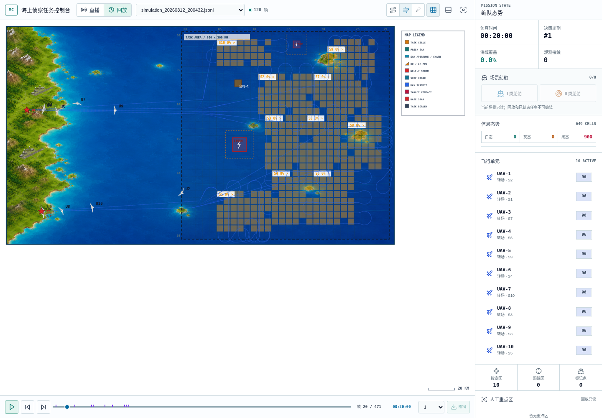
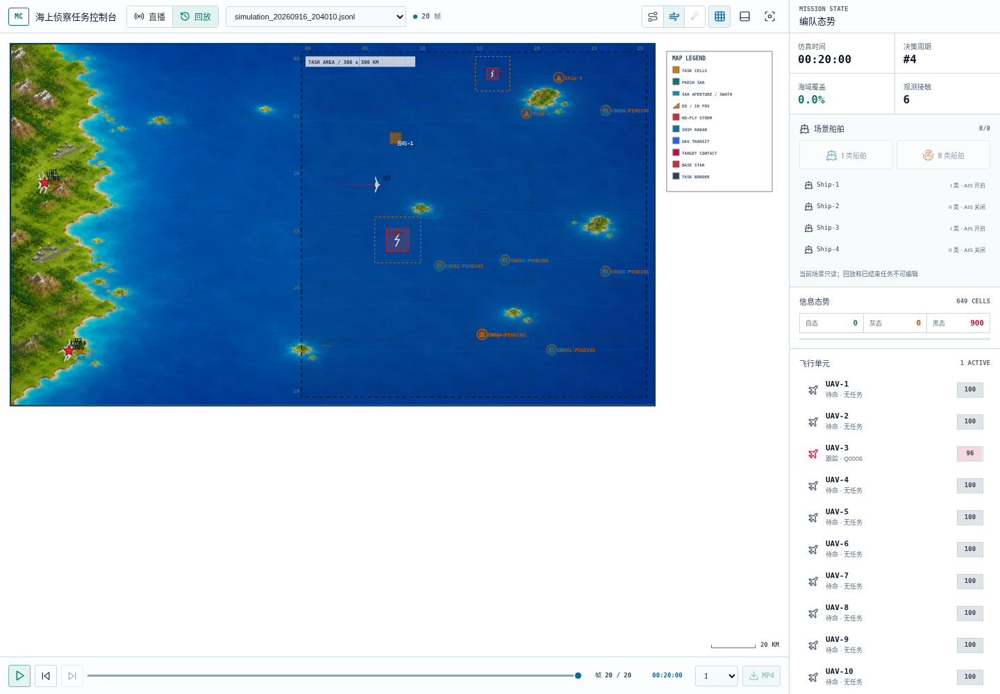

# 混合海上任务执行闭环与回放基础效果恢复设计

> 状态：待用户审阅；2026-09-16。本文及配套实施方案均不代表已获实施批准。本轮只交付文档和既有审查截图。
>
> 代码审查基线：`bc8d76f4003ba9abdc5f8d6d637fc2ecbadf60de`。实施前必须核对 HEAD、工作区和相关接口差异。
>
> 配套方案：[逐项实施与验证计划](../plans/2026-09-16-replay-visual-restoration-plan.md)。目标执行者：Luna max；按依赖顺序完成任务，不要求并行代理。

## 1. 目标、范围与验收含义

恢复旧回放所具备的基本可读性：看得见任务区域、各 UAV 的转场与扫掠路线、真实运动轨迹、传感器工作、扫描覆盖变化、目标发现与后续调查。保留现有 AIS、无源观测、I/II 类研判、动态船舶、控制权隔离及 LLM 混合调度机制。

“恢复旧效果”指信息完整性、运动连续性与任务过程可解释性，不要求新算法逐帧复制旧路线、10 架 UAV 永远搜索、相同最终覆盖率，或为了画面提前暴露船舶真值。混合任务首轮可以是探查与搜索并行；10 架资源不应因错误状态或虚假的不可行理由长期停在基地。

本轮范围：批量探查会话、任务释放/快照一致性、可验证的空闲资源利用规则、控制器路线只读快照、帧与前端适配、目标和事件可读性、短中长程验证设施。

不在范围：重写优化器、训练 BC/RL、重做底图和整体 UI、放宽航程/运动学/观测门、改变历史 JSONL、通过 UI 动画模拟未发生的搜索、以固定任务分配器替代正式 LLM。

## 2. 事实基线与证据等级

完整文件摘要见 [baseline-manifest.json](assets/2026-09-16-replay-restoration/baseline-manifest.json)。截图为当前同一前端加载原始帧的对照，回放 API 被 Playwright 截获并提供原日志；它验证渲染差异，未验证服务端回放适配。正式验收必须补真实 API。

| 指标 | 旧 `20260812_200432` | 新 `20260916_204010` | 新 `20260916_210604` |
| --- | --- | --- | --- |
| 实际帧/末仿真分钟 | 471 / 471 | 20 / 20 | 20 / 20 |
| 配置 total_steps | 480 | 20 | 20 |
| t=20 搜索区 | 10 | 0 | 0 |
| t=20 非空 planned_path / mission_route 的 UAV | 10 / 10 | 0 / 0 | 0 / 0 |
| t=20 状态 | 10 transit | 9 idle、1 tracking | 9 idle、1 tracking |
| t=20 覆盖率 | 0% | 0% | 0% |
| 首次覆盖 | t=24 | 无 | 无 |
| 最后覆盖率 | 56.3553% | 0% | 0% |

同一时刻截图：





| 问题 | 证据及确定性 | 设计处理 |
| --- | --- | --- |
| F01 探查 ID 重复 | 已离线复现：6 个批量任务全为 P0001，仅 1 个 ProbeSession 留存；`apply_assignment_batch` 准备阶段读同一计数器，提交阶段才递增 | 批内预分配、事务边界、存储冲突防线 |
| F02 任务状态残留 | 新日志提示词显示已 holding/加油的任务仍 executing，接触点已经 pending | 任务生命周期对账与终止清理；测试定位所有入口 |
| F03 LLM 漏派搜索 | `210604` 首轮 6 probe、4 idle，3 个可行搜索候选被忽略；后续空选择声称无边，输入却有边 | 确定性增补可行性校验，原网关纠错重试 |
| F04 路线导出断链 | ProbeController 私有 RouteFollower 与实体航线分离；新日志航线恒空 | 权威控制器只读路线快照，禁止回放层重新导航 |
| F05 目标展示退化 | 有 contacts 时 renderFrame 跳过 drawShips；场景符号与接触标签叠加 | 观测目标船形符号、场景层显式开关、统一标签避让 |
| F06 旧字段误导 | t20 UAV-3 的 status=tracking、operation_mode=probe、sensor_mode=off | 新帧提供任务/阶段展示字段，UI 不把接近称为已跟踪 |
| F07 事件时间轴缺漏 | useReplay 仅识别 target_found/llm_decision/uav_returned | 新旧事件映射、去重、跨块跳转与文件切换测试 |
| F08 航线取尾段 | frame_builder 使用 `[-planned_limit:]` | 当前位置之后的航段取前段，整条任务路线均匀采样并保留端点 |
| F09 可能的长程导航问题 | 现有日志只有 20 分钟，单机直飞不足以判定导航错误 | 实施设专项门：真实导航到达、EO 阶段推进、地图变化；不能预先宣称算法必然失效 |

时长与机制必须分别验收：20 分钟不要求已完成远程探查，但应看到已提交任务和真实规划；120/480 分钟才验证探查和覆盖闭环。旧种子相同不等于同一场景，旧/新 searchable_cells 和数据模型均不同，禁止以覆盖率完全相等作为回归标准。

## 3. 备选方案与推荐

| 方案 | 收益 | 缺陷 | 结论 |
| --- | --- | --- | --- |
| 仅延长到 480 步、修改提示词 | 改动小 | 不解决重复 ID、幽灵任务、空航线；文字规则无硬约束 | 不采用 |
| 回退旧调度/前端 | 容易获得旧画面 | 丢失混合任务和观测隔离，造成两套运行路径 | 不采用 |
| 保留新版架构、修复执行并增加只读可视化契约 | 同时恢复运行与展示，可逐层验收 | 跨控制、调度、前后端，需完整集成测试 | 推荐 |

不增加可长期分叉的“旧算法演示模式”。离线 scripted provider 仅为标明来源的测试夹具。

## 4. 全局约束与不变量

- G01：业务实现必须在用户批准本设计与实施方案之后开始。
- G02：唯一运动入口仍是 ControlCoordinator → SafetyEnvelope → UAVDynamicsExecutor；帧、渲染与测试不得旁路推进实体。
- G03：同一 episode 内不同探查会话 ID 不复用；同一探查续派保留 ID，不重置有效证据。
- G04：对外发布的每个 approved/executing 且有 assigned_uav_id 的 TaskRecord，必须对应当前有效控制任务及 generation；return/holding/refueling 不能再占用旧 probe。
- G05：正式任务选择仍由 LLM 完成；确定性模块只做可行性、约束校验及既有配对；失败不得静默代选。
- G06：展示数据只读、有限、按 episode/generation 隔离；读取和重复序列化不得推进路线、消耗随机数或触发规划。
- G07：搜索框、扫掠、SAR 足迹、EO 视场只能来自已提交任务与实际传感器状态；场景真值不得进入调度观测或接触分类。
- G08：原始三份 JSONL 不改写；老格式能回放，缺数据只做有依据的兼容，不补造航线或识别结果。
- G09：新测试必须分清静态渲染、真实引擎离线闭环、真实模型运行三类证据。
- G10：不改物理参数换取验收通过；新增依赖默认零，沿用 pytest、Playwright、React/Canvas。

## 5. 批量分配与会话事务

### 5.1 修复编号

`SimulationEngine.apply_assignment_batch` 在准备阶段建立局部 `next_probe_number`，每创建一个新 probe 立即对局部值递增；续派同 task/probe 时复用旧 ID，既不递增也不重新构造 session。完全提交后一次性写回全局计数器。

```python
next_probe_number = self._next_probe_number
# 位于每项候选验证、contact 解析完成之后。
if reuse_existing_probe:
    probe_id = active.probe_id
else:
    probe_id = f"P{next_probe_number:04d}"
    next_probe_number += 1
# 本地 prepared 已携带唯一 ID；完成提交后才发布 next_probe_number。
```

`StateManager.set_probe_session` 允许同 ID、同 contact/uav 的阶段更新；拒绝同 ID 被不同 contact/uav 覆盖。接触合并时采用显式重绑定入口，验证 canonical alias 后替换，不能关闭冲突检测。跨 episode 重置必须清空旧会话。

### 5.2 原子性边界

提交前完成：snapshot/information/map 版本、generation、资源、重复 task/uav/contact、路径、会话 ID 冲突、交接前置条件验证。不得在 coordinator 已安装之后再因可预见的 handoff 参数问题 `return False`。

现有 `contacts.reserve` 的失败回滚使用 release 会丢失旧保留信息。改为只保存受影响 contact 的事务前快照，并在失败时恢复原 reserve 字段、revision、events/cooldown；禁止 deepcopy 整个引擎。复用 coordinator 已有原子安装，不新建通用事务框架。

在没有完整回滚能力的提交后意外异常中，不能返回“未提交”并继续运行：记录明确 commit failure 并停止本次步进，保留诊断。正常可预见失败必须保证无半提交、无 ID 消耗、无成功事件。

续派必须测试旧 baseline_started/valid samples/phase 原样保持。交接给另一架 UAV 是新会话，不是续派。

## 6. 任务结束、资源与快照一致性

在仿真线程统一收口任务结束记录；建议窄 helper：

```python
def _close_mission_task(
    self, uav_id: str, task: ControlTask, *,
    status: str, reason: str, current_time: float,
    preserve_search: bool = False,
) -> None:
    """幂等同步 record/contact/probe/region/cache，并发出一次结束事实。"""
```

调用入口包括 holding 提升、返航、probe_blocked、probe/approach timeout、任务失败、I 类释放、接触丢失/合并重复任务、删除船舶、加油重置。保留已有正确处理，不重复造事件；从当前 control task 捕获旧任务后再切换。

| 原工作与原因 | record 结果 | contact/session | 资源结果 |
| --- | --- | --- | --- |
| probe 阻塞/超时/异常 holding | blocked、清 assigned、记录 reason/time | 仅释放匹配当前 task/probe 的 reservation；清对应 session | SYSTEM holding/return/refueling，不进入可分配池 |
| I 类研判完成 | completed | 沿用 I 类冷却；释放会话 | 后续由现有控制流恢复可用 |
| II 类 probe 转 track | probe completed，track 独立记录 | 保留正确 contact 归属；清已完成 probe | track 受保护 |
| 搜索完成 | completed，region completed | 不涉及 contact | 现有流转 |
| 搜索被合法抢占 | approved、assigned=None、finished=None | 保留区域与完成度可续派 | 新任务归属 |
| 删除/重复接触任务 | cancelled 或现有已约定终态 | 仅清本任务，不清 canonical successor 的 reservation | 现有安全转移 |

对账在调度 snapshot 构造之前进行，执行后/发布前再做断言或结构化诊断。不要把“从未提交、仍为 approved 的可续派搜索”误当幽灵任务删除。

`available_uav_ids` 应与实体 refueling/holding/returning、安全状态、coordinator lease 一致；generation=0 不是不可用理由。所有资源变更通过已有事件触发重调度，并遵守现有冷却；去重后每个释放/加油完成只触发一次。所有断言测试必须检查 contact、session、record、lease、entity 和下一 snapshot，而不仅是字符串状态。

## 7. 调度约束：有合法增补任务时不能无理由闲置

### 7.1 精确规则

采用“选择集不可再合法增补”而不是求全局最大覆盖/最大任务数。先执行现有基本校验；仅对已经合法的选择集 S 检查：当前实际送入提示词的候选中，是否存在未选的新任务 t，使 S∪{t} 在不新增抢占、遵守区域不交叠/资源保护/冷却/燃油/唯一 contact 的条件下，仍能完整配对，并使**原本真实空闲资源至少增加一架投入**。

允许重新匹配本次尚未提交的 S，但不得重排 protected active tasks。使用既有 `_edge_options` 与 `_maximum_matching`；预检错误与增补检查分层，禁止递归调用包含增补规则的自身校验。

存在时返回 `underutilized_feasible_work:<task_id>`，附带可行 UAV witness 供纠错。空选择也适用，非空 defer_reason 不能绕过；不可行、全受保护、无可增补、几何冲突等情况下允许空选择并说明真实原因。

不硬编码“10 个搜索区”或“6 probe + 4 search”。审查首轮有 6 probe + 3 个互不重叠搜索候选时，应能够并行分配 9 项；剩余一架无新增合法任务时允许闲置。真实运行可选不同组合，但最终不得存在上述增补 witness。

本轮不引入“战略保留空闲资源”的自由文本豁免；若用户需要此策略，应另行设计显式资源预留字段。这是待审阅的重要策略决定。

### 7.2 Prompt 与重试

提示词增加：generation 的准确语义、真实可用资源总数、保护任务列表、搜索可行 UAV 摘要、必须消除可增补空闲的规则。Prompt 可见候选集与校验可增补集合必须一致；不得以模型没看到的候选拒绝结果。完整池公平窗口保持现有逻辑，测试窗口截断后仍可完成一个合法选择。

复用 `LLMGateway.request_json(validate=...)` 的已有纠错、attempts、deadline 和重试上限；不另加无限 while。预算耗尽时不提交新批次，保持有效任务，并通过 runtime 诊断和回放事件显示决策失败。已过期 snapshot 不接受迟到回复。

在 `selection_interaction` 加可用数、已选数、增补错误及 witness 等诊断，但不向产品界面灌入内部图结构。

## 8. 权威路线展示契约

### 8.1 只读结构

在 `src/control/common/contracts.py` 增加冻结类型；这里只描述数据，不允许调用导航：

```python
@dataclass(frozen=True)
class ControlRouteSnapshot:
    task_id: str | None
    task_type: str
    phase: str
    target_contact_id: str | None
    route: tuple[Pose, ...]           # 当前控制器确实规划的整条路线
    next_index: int                  # 下一个待访问点；len(route) 表示已结束
    route_revision: int             # 仅重规划时增加
    planning_map_version: int | None
    status: str                     # ready / pending / guidance_only / unavailable / cleared
```

ControllerBase 增加非抽象 `route_snapshot() -> ControlRouteSnapshot | None`，默认 None，不强迫 BC/RL 提供路线。Coordinator 公开 `route_snapshot(uav_id)`，持锁读取并在返回时封装当前 StateManager.episode_id、lease.generation；不暴露 controller 私有对象。

用第二个冻结 `UavRouteSnapshot(episode_id, generation, route: ControlRouteSnapshot)` 保存包络。StateManager 只保存每 UAV 最新只读包络，供现有 build_frame 路径读取；Simulation 在成功提交后、每次 control tick 后、释放/重置时发布。它不是新的任务权威源。

### 8.2 各控制器规则

- Coverage：导出现有 route/follower/phase；必须包含真实 transit 与剩余扫掠，不能把旧实体搜索规划当成控制器路线。若 coverage 的起始规划已经完成，首个提交帧即可 ready。
- Probe：start_task 基于 contact observation 规划 baseline 接近路线；无需 probe session 已发布，避免先后顺序循环。act 保持真实重规划；route_revision 每次更换 route 增加。baseline/closing/near/awaiting_assessment 分别显示；接近阶段 sensor off 不显示已跟踪。
- Track：接近/入轨使用 route/follower；避障优先用 avoidance_route 对应 follower。LGVF 纯反馈阶段可以 `guidance_only`，保留真实 trail、目标与阶段，不伪造未来闭合轨道。
- Return/Holding：有规划路径时导出；无航线时声明 guidance_only/unavailable，不复用已取消搜索路线。
- Idle/Refueling：显式 cleared，防止 fallback 显示旧任务。
- Learning：默认 unavailable；不能为了航线效果强制启用 heuristic。

`next_index` 与现有 RouteFollower.index 不等价：现有 index 是已到达/消费位置，适配时通常 next=index+1，完成为 len。必须逐控制器测，不在 UI 猜。

### 8.3 帧扩展与兼容

保持 `mission-frame/v2` 主结构不变，增加 `visual_schema_version: "mission-visual/v1"`；每 UAV 增加可选 `task_visual`：task_id/type/phase/contact_id/generation/route_revision/planning_map_version/route_status/route_source/observation_started。`route_source` 为 controller/legacy/none。

新缓存存在且 generation/episode 匹配：从只读 snapshot 输出 `planned_path` 与 `mission_route`；显式 cleared/unavailable 时不回退旧实体。缓存不存在的历史/旧测试路径才允许 legacy fallback。

- planned_path：当前真实 pose + route[next_index:] 的前 N 点，N 沿用 realtime=100、replay=500 的总预算，预算内包含当前点；不使用尾部切片。
- mission_route：整条路线保留首尾并均匀采样，realtime<=200、replay<=800；不单纯截尾。显示虚线概览不参与导航；不能用简化线段做安全证明。
- trail：仍是真实执行位置，独立于预测路线。
- transit_progress：有真实转场段边界才计算；无数据时 null，禁止“空路线=100%”。
- `observation_started` 从匹配当前 task/probe 的公开 ProbeSession 读取：baseline 阶段为 baseline_started_at_min 非空，near 阶段为已进入 near，closing 为 false；非 probe 为 null。phase=baseline 但尚未到达时仍显示“接近调查”，不能仅凭 phase 名称画成观察。
- 新路线元数据与旧字段必须来源一致；过期 generation 数据丢弃且给诊断，不覆盖新任务。

连续性测试以未裁剪 snapshot 与已执行位置为准，并检测输出首点=当前 pose、第二点位于剩余路线前部。对空、单点、长路线、已结束、reset、旧 JSONL 都测试。

## 9. 传感器、覆盖和阶段语义

继续用实际 applied_command、传感器转场、稳定航向和扫描资格计算足迹。前端不得将 `operation_mode=coverage` 或 `status=tracking` 直接当成开机。

SAR：采集中强调实际 swath/beam；有待机波束时用淡色明确区别，待机/U-turn 不增加扫描计数。EO：只有传感器实际活动且 FOV 存在才绘制；接近、转场、等待研判时依据真实 off/切换状态隐藏。新旧 sensor fallback 必须以 visual_schema_version 区分，避免为新帧错误沿用历史简化语义。

coverage_pct=100*scanned_searchable_cells/searchable_cells（分母为0时约定0），地图变化可导致比例变动，不能无条件断言单调；固定掩码的受控测试才断言单调。信息新鲜度允许衰减，与“累计扫过面积”分开。

新增诊断测试用真实 navigator、真实 executor 推进远离水平初始航向的接触点：20 分钟检查朝正确方向接近，120 分钟检查 baseline/near/assessment 门。若只有 spy 导航可通过而真实导航失败，必须先定位再补最小修复，不能仅增加超时或关闭障碍。

## 10. 前端展示规则

### 10.1 保留底图与图层层级

顺序：信息背景 → 障碍 → 重点/搜索区域 → 真实 trail → 任务虚线与近期实线 → SAR/EO → 观测目标 → UAV/基地 → 标签/图例。旧黄色搜索区与路线表达保留，只有已提交 region 才绘制。

相同任务 phase 在地图、侧栏和详情一致：`转场搜索`、`搜索扫描`、`接近调查`、`基线观察`、`近距观察`、`等待研判`、`接近跟踪`、`持续跟踪`、`返航`、`等待降落`、`加油`、`待命`。映射由新增纯函数 `uavDisplayState(uav)` 统一；新帧优先 task_visual+active_mode+sensor_mode，旧帧 fallback status。

### 10.2 目标与场景层

默认任务视图显示观测 contacts；用中性船形符号代替仅圆点，未知类型不能画“航母/驱逐舰”真值型号。已识别 I/II 类用类别颜色/符号，位置、航向取估计位置/估计速度。仍保留未知、lost、stale 和不确定度语义。

旧格式只有 ships 时保留原图标分支；若非空 contacts 已代表新模型，不混画旧 ships。空 contacts 且 ships 有合法旧观测时维持现有 fallback。

增加显式“场景真值”图层开关，运行/回放默认关闭；初始化编辑/放置时可显示场景层并明显标注“场景”。开启仅改变画面，不进入蓝方算法。该默认行为改变需用户审阅。不通过空间邻近猜测 contact 与真值船的 ID 关联。

labels 使用统一的屏幕空间占位器：选中对象 > UAV > 已分类 contact > 未分类 contact > scenario。8 个固定候选偏移、地图内裁剪、必要时引线；低优先级无位置则只隐藏文字、保留符号，hover/选中显示。重复小数偏移或随机摆放不可接受；基地多机符号沿用现有 offset，标签另行布局。

### 10.3 时间轴和回放

抽取事件纯函数 `collectReplayMarkers(frames)`，同时支持旧 `llm_decision/target_found/uav_returned` 与新 `mission_assignment_committed/contact_created/probe_phase_changed/type_i_assessed/type_ii_assessed/probe_timed_out/mission_assignment_rejected/task_failed/uav_refueled`，以及新任务结束/调度校验失败事件。每个 canonical event 只显示一次，key=type+time+稳定排序后的data；数组顺序不改。

事件绑定首次出现在帧流中的索引，不能假设一分钟等于一个数组下标。首次仅加载120帧不能宣称整段已完成；进度读数用total，加载数单独标识。切换文件清空事件与旧路线；任意跳转等待目标帧，不用邻帧冒充目标时间。文件只读，不允许操作影响 live。

## 11. 验证体系与量化门槛

### 11.1 三层测试，不能互相替代

1. 单元/契约：快、完全离线；覆盖事务、状态、匹配、路线导出、绘制和兼容。
2. 引擎闭环：scripted 模型输入输出，真实调度校验、navigation、coordinator、executor、sensor、build_frame、JSONL，不手工塞 search_regions 或覆盖字段。
3. 正式 LLM：真实模型、完整480分钟、保存调用和失败情况；不保证某固定 seed 覆盖率必达56.3553%，但所有结构与一致性不变量成立。模型失败或环境阻塞必须明确报告未通过，不使用离线结果冒充。

现有 `run_visual_fixture_server.py` 循环写相同引擎状态，适合组件/响应式测试，不能作为第二层。新增专用引擎场景 runner，原夹具保留，报告明确标记 provenance。

### 11.2 可复现场景

| 场景ID | 设置及步数 | 硬验收 |
| --- | --- | --- |
| V01 批量探查 | 原配置seed42、选择6 probe，运行2步 | 6唯一ID/6 session，所有对应关系一致；无会话冲突导致holding；不要求已抵达 |
| V02 混合调度 | 6 probe + 3不重叠且可行search的确定性snapshot | 6-only返回增补错误；6+3合法；1架剩余无增补可闲置 |
| V03 搜索展示 | 10 UAV，受控无动态障碍、合法近场搜索，20/120步 | 提交后搜索区>0；路线ready或明确pending；t20有多机真实位移；t120覆盖>0且出现SAR实际足迹 |
| V04 远程调查 | 无障碍，起点(1,11)、接触点(12,18)，合法固定翼参数、观测来源受控，120步 | 真实转向接近，baseline/near各满足样本门再研判；EO出现与状态一致；不能直接注入识别结果 |
| V05 中断与再派 | V03/V04中触发holding、timeout、低油返航、加油 | 旧任务终态、无幽灵executing；保护资源不可派；可用后下一合法调度周期有任务或真实无可行原因 |
| V06 完整混合 | 默认配置seed42和101，scripted角色、480步 | 无ID冲突/资源状态冲突/非有限值；覆盖>0；活跃路径不全空；完整产物记录各阶段是否发生，未发生不可伪造 |
| V07 专项跟踪接力 | 可达目标、真实样本满足分类门、scripted合法II类研判，480步 | 有真实track/EO、一次有意设置的合法返航与后继接力；与普通V06随机发生率分开 |
| V08 老回放 | 三份原文件+少量抽取匿名fixture | 原SHA不变，旧搜索区/轨迹不丢，新坏日志仍忠实呈现缺陷；不假装历史已修复 |
| V09 模型失败 | 非法空选→纠正；持续非法；超时；迟到回复 | 有界重试，失败不提交/不假派任务，现役任务不破坏，UI可见失败事件 |

V03近场 bbox 通过当前 search route planner 实际验证，若(5,9,9,14)等位置被配置障碍遮挡，使用固定的测试无障碍环境，不改正式配置。多个 bbox 由合法网格枚举生成，禁止硬塞重叠区域。V04观测轨迹为测试输入，不使用船舶隐藏类型推断研判。

### 11.3 视觉检查与截图矩阵

固定 Chromium、deviceScaleFactor=1、1440×1000，页面内 freeze phase/frameCount，等待图片/fonts加载和目标帧索引满足后截图。另验证1280×720与390×844，无需每个尺寸全部长跑。

截图至少：旧t20；修复后混合t1/t20；首次SAR；EO基线/near；已识别/跟踪；返航；t120/t480；场景真值开关；同位置多个contact；失败状态。没有发生的阶段必须用真实受控专项场景得到，不能拼帧。

门槛：搜索层有区域色块及任务ID；ready路线>=2点且连接真实位置；同屏传感器图层状态匹配；选中标签完整且不越地图边界；未选普通标签矩形不重叠；时间轴至少包含该场景实际生成的新任务/观测事件。截图 diff 用于稳定专用fixture，历史与新策略不做整屏像素相等。

性能：路线点数不超过本节契约；每次渲染/构帧零导航调用；循环序列化不改变引擎状态。记录固定环境500帧的render耗时P50/P95、JSONL大小和构帧耗时，不无依据宣称达到60fps。与同机同fixture基线相比P95不得恶化超过20%；若基线噪声导致不稳定，保留原始样本并重测一次，不任意放宽门槛。

### 11.4 完成定义

必须同时具备：全部指定自动测试通过；20/120/480离线产物；真实模型运行结果或明确未完成项；旧文件SHA未变化；真实回放API与导出链路通过；前后对比截图及人工逐项核对；任务到测试追踪表无空项。只有离线通过时只能宣称“实现及离线验收通过，真实模型验收未完成”，不能宣称已全面恢复。

## 12. 风险、兼容和实施顺序

- 新利用规则减少模型自由等待，可能增加纠错次数；使用现有30秒决策预算，不扩大调用次数掩盖问题。
- 覆盖控制器与旧实体规划可能不同，显示必须跟随实际控制器。旧实体路线在避障/冲突检测仍有引用时，禁止直接删除；另以所有权测试防旁路修改。
- Probe每次AIS更新重规划的性能/转向行为需V04实测；先保留原策略，失败才进入有记录的最小修复，不顺带重写导航。
- 对账不应改掉BC/RL控制权语义；观测快照缺路线是合法降级。
- 原始日志体积大，CI用有来源标记的少量抽样；本地正式对比用原文件hash保证来源。
- 应先修F01/F02，再收紧调度，再导出路线，最后调整UI与验收；不能靠UI修饰绕过运行问题。

## 13. 用户审阅重点

1. 接受“无可行增补才允许剩余空闲”的默认约束，不保留自由文本战略等待豁免。
2. 接受默认隐藏场景真值、保留显式开关，观测接触仍正常显示。
3. 接受保留新版混合任务，不强求10架同时搜索；验收以完整且真实的任务过程为准。
4. 接受先通过离线闭环，再执行真实模型480分钟验收；本轮文档不启动这些执行。

上述为完整建议默认值；用户可在审阅时修改，批准前不实施。

## 14. 用户追加要求：基础效果不退化，已有功能完整接入

本节将用户后续要求纳入正式范围，优先于前文对“基础恢复”的狭义理解：当前算法来自原算法改进，必须 **基础效果成立 + 改进功能正常进入主链路 + 改进过程可解释展示** 三项同时成立。不能只修复本次发现的几个症状后结束。

“完整接入”不是把每个源码文件都强行调用一次，而是对每个已实现业务能力确认其正确运行入口、适用前提、触发、输入、状态改变、下游消费者、可观察证据以及异常行为。历史兼容器不重新成为实时主路径；BC/RL 抽象接口不等于已有可运行策略；跨 episode 记忆不应在首个 episode 伪造激活。

新增不变量：

- G11：每项已有业务能力必须在功能接入矩阵中有归属与通过证据；发现断链需修复，不能以“本次只是可视化”排除。
- G12：演示按“搜索基础 → 新线索 → 信息场/调度变化 → 调查识别 → 跟踪接力/恢复搜索”组织，新增功能不能使搜索、传感器、导航、返航基础功能失效。
- G13：展示“功能已工作”必须有因果链；宣称“性能更好”还必须有同场景/同预算配对实验，不能从更丰富的动画推导性能提升。

### 14.1 功能接入初始清单（实施T00补全证据，不得随意删项）

代码路径以仓库根目录为基准。表中入口是本轮静态审查定位，不代表完整链路已经通过。

| ID | 能力 / 类别 | 主要实现与应核对入口 | 应产生的结果与展示 | 必须验证的反例 |
| --- | --- | --- | --- | --- |
| B01 | 分区搜索、候选生成、配对 / 基础 | `src/mission/task_catalog.py`、`mission_scheduler.py`、`src/schedule/task_allocator.py`、`candidate_extractor.py` | 合法搜索区域→已提交任务→多机不同路线 | 重叠/不可达/燃油不足不能强派 |
| B02 | 固定翼转场、扫掠 / 基础 | `src/control/heuristic/coverage.py`、`navigation.py`、`src/utils/search_route_planner.py` | 真实转向、直线扫描、U-turn；规划与实际一致 | 不能瞬移、不能转弯时刷新扫描 |
| B03 | SAR 探测 / 基础 | `src/env/simulation.py::_update_sensors_and_detections`、`sar_sensor.py` | 足迹→扫描格→接触/信息变化 | 无SAR采集不能有新增扫描 |
| B04 | EO 跟踪 / 基础 | `src/control/heuristic/tracking.py`、`src/env/eo_sensor.py` | 接近/入轨/持续EO与视场 | 超范围或遮挡时不保持虚假锁定 |
| B05 | 地形/雷云/冲突规避 / 基础 | `navigation.py`、`src/utils/storm_avoider.py`、`conflict_detector.py`、simulation冲突入口 | 改道、实际安全控制、清楚路线更新 | 旧路径失效后不能继续画ready；不绕过coordinator |
| B06 | 多基地、燃油、返航加油 / 基础 | `src/env/base_station.py`、`src/control/heuristic/return_to_base.py`、simulation | 正确返航基地、holding/排队、加油和重新派工 | 未到基地不加油；保护资源不抢占 |
| B07 | 信息衰减与覆盖 / 基础 | `src/mission/information_update.py`、`src/schedule/info_value_table.py`、state | I/V/覆盖分别变化，色块与计数一致 | 不把衰减当作已扫面积丢失 |
| B08 | 事件触发与Reviewer / 基础 | `src/schedule/trigger_manager.py`、`llm_reviewer.py`、`task_allocator.py::mission_step` | heavy/light与原因、review摘要进入后续prompt | 事件丢失、无限重触发、review失败覆盖有效任务 |
| B09 | 直播/回放/导出 / 基础 | `src/vis/backend/frame_publisher.py`、server、前端useReplay/useMp4Export | 同一帧语义一致；暂停、跳转、倍速、MP4 | 未加载帧冒充目标；回放写live；导出缺层 |
| I01 | AIS 接触与独立开关 / 改进 | `src/env/ais_signal.py`、simulation AIS采样/命令入口 | AIS轨迹、contact、I/V变化、开关状态 | 关闭后停止新AIS证据，不抹历史；I类过滤不伪改类别 |
| I02 | 单机无源方位 / 改进 | `src/sensor/passive.py`、simulation `_update_passive_sensors` | bearing线索、来源、时间和价值影响 | 单机不能展示确定点或通过真值导航 |
| I03 | 多机同源同时定位 / 改进 | 同上、`PassivePosition` | 条件位置→investigation搜索候选→LLM选择 | 不同源/不同采样时刻不能混合定位 |
| I04 | 接触关联、合并、丢失 / 改进 | `src/mission/contact_store.py`、simulation lifecycle | canonical contact、去重任务、lost/stale可见 | 合并不得释放后继合法reservation |
| I05 | 渐进调查与研判 / 改进 | `probe.py`、`trajectory_features.py`、`contact_assessor.py` | baseline→near→有证据I/II分类；证据可查 | 未满足样本门不研判；unknown不能画已识别 |
| I06 | 作业活动与逃逸判定 / 改进 | `src/env/ship.py`、`vessel_activity`相关测试、`evasion_detector.py` | 类别/活动分开，观测支持的证据与价值变化 | 岛屿迫转等混淆不误判；隐藏red plan不进蓝方 |
| I07 | 统一证据与重规划 / 改进 | `evidence_store.py`、`information_update.py`、trigger、task_catalog | evidence→information_version→候选→选择→任务→观测 | 单证据重复消费、过期不撤销、版本不一致 |
| I08 | 人工重点区域 / 改进 | `intent_commands.py`、`intent_store.py`、simulation队列、`IntentPanel.jsx` | 创建/修改/取消/过期→候选/重访→完成度 | 错revision拒绝；回放只读；不私自抢占probe |
| I09 | 船舶动态增删与AIS命令 / 改进 | `vessel_commands.py`、simulation mutation、`surveillance_stage.py` | 命令ack→场景/观测/任务全链清理；UI状态一致 | 重放旧episode命令、船在陆地/边界外、删除遗留任务 |
| I10 | 红方LLM与边界运动 / 改进 | `red_commander.py`、`ship_navigation.py`、simulation `_prepare_red_decision` | 物理可行的船舶行为；红蓝信息隔离 | 模型失败应按现有paused_model；不能泄漏计划 |
| I11 | 跟踪交接 / 改进 | `handoff.py`、simulation `_require_handoff`/EO lock | required→assigned→EO acquired，有明确时延 | 仅分配不算交接成功；超时应失败 |
| I12 | 公平候选窗口 / 改进 | `prompt_window.py`、scheduler `_prompt_payload` | 可行候选有界公平曝光、选中后执行 | 过滤后永远看不到某类任务；隐藏候选拒绝模型 |
| I13 | 评估与日志 / 改进支撑 | `outcome_evaluator.py`、`episode_logger.py`、`scripts/evaluate_mixed_maritime.py` | 来源明确的时延/覆盖/识别/接力指标 | 无分母不能100%；失败episode不能作为成功证据 |
| I14 | 策略记忆与验证 / 跨episode | `strategy_memory.py`、`llm_reviewer.py`、`scripts/validate_strategy_memory.py` | 合法live历史→candidate→验证/holdout→active→后续prompt | fixture不能成为生产记忆；未验证不得激活 |
| E01 | BC/RL扩展 / 接口能力 | `src/control/bc/base.py`、`rl/base.py`、factory、ownership | 有provider时正常注入；无provider明确失败 | 不声称训练已实现；不静默降级heuristic |
| C01 | 历史兼容 / 边界能力 | replay_adapter、legacy scheduler/test adapters | 旧日志和必要旧接口可用 | 不让旧adapter代替新版mission主路径 |

### 14.2 接入矩阵与修复台账格式

实施产物 `docs/validation/replay-restoration/feature-integration-matrix.md` 必须逐项包含：

`ID | 默认启用/条件启用/离线/扩展/兼容 | 配置键或前提 | 唯一入口(函数) | 上游数据 | 状态写入者 | 下游消费者 | event/frame/UI | 正向测试 | 反例测试 | 端到端产物 | 结论`。

结论只能为 `通过`、`已确认断链待修`、`待验证`、`按设计未触发`、`仅扩展接口`、`仅兼容`。按设计未触发须给出专项场景覆盖，不能用此状态通过整项验收。I14的真实跨episode证据不足可明确记为“正式验证未完成”，并阻止“全部完成”的结论。

新发现断链必须形成 `问题→最小修改→回归测试→端到端证据`，分配到T11/T12/T13；若需要新业务算法而非接线修复，保留事实并提出补充设计，不能未经批准扩大策略。

### 14.3 改进效果演示分镜及证据

| 阶段 | 必须保留的基础效果 | 突出的改进 | 证据链 |
| --- | --- | --- | --- |
| 起始20分钟 | 多机实际执行、任务区、路线、状态可读 | AIS接触与搜索/调查并行 | 初始snapshot→LLM选择→region/task/route |
| 获得新线索 | 搜索仍持续、航线连续 | 单机方位到多机条件定位 | observation IDs→evidence→information delta |
| 再决策 | 合法改道、不丢失未受影响任务 | 价值变化/重点区触发动态重派 | trigger→snapshot version→call→assignment |
| 调查识别 | EO真实视场、运动合理 | baseline/near证据积累，类别与活动拆分 | samples→assessment→contact/UI |
| 持续任务 | 燃油/返航/区域续派继续工作 | II类跟踪、接力、I类释放恢复搜索 | handoff/closure→下一有效任务 |
| episode结束 | 完整可回放/导出 | 指标、review与经验证的后续记忆 | outcome→memory版本→下一episode prompt |

单个自然随机episode不保证触发全部功能，演示包可含多个有标题、条件说明和真实引擎来源的专项片段。禁止剪接不同episode而不标注。每个片段保留时间、seed、角色来源；底图颜色变化旁用事件详情解释“为什么”，不需要同时铺满所有调试字段。


### 14.4 策略记忆的正式运行入口

当前 SimulationEngine 已接受 strategy_memory_store/strategy_memory_version 注入，验证脚本可指定版本，main CLI尚未公开该入口。本轮建议把既有能力接到规范运行入口，而非新增学习算法：

- main.py与scripts/run_simulation.py增加 `--memory-version`（默认baseline，允许active或明确manifest版本）和 `--memory-root`（默认outputs/strategy_memory）。
- active在episode初始化时解析一次为具体版本；baseline不加载策略；指定不存在版本启动失败，不能静默退回baseline。
- 使用现有StrategyMemoryStore与SimulationEngine构造参数，episode期间冻结版本；manifest/frame/模型上下文记录同一具体版本。
- `clear_outputs_before_run=true`且memory-root在即将清理的outputs内时启动失败并说明原因，不能先清掉用户指定记忆再执行；默认false不受影响。
- 生成、验证、激活仍走既有Reviewer与validate_strategy_memory离线流程，不能为了演示省略真实历史或holdout门槛。
