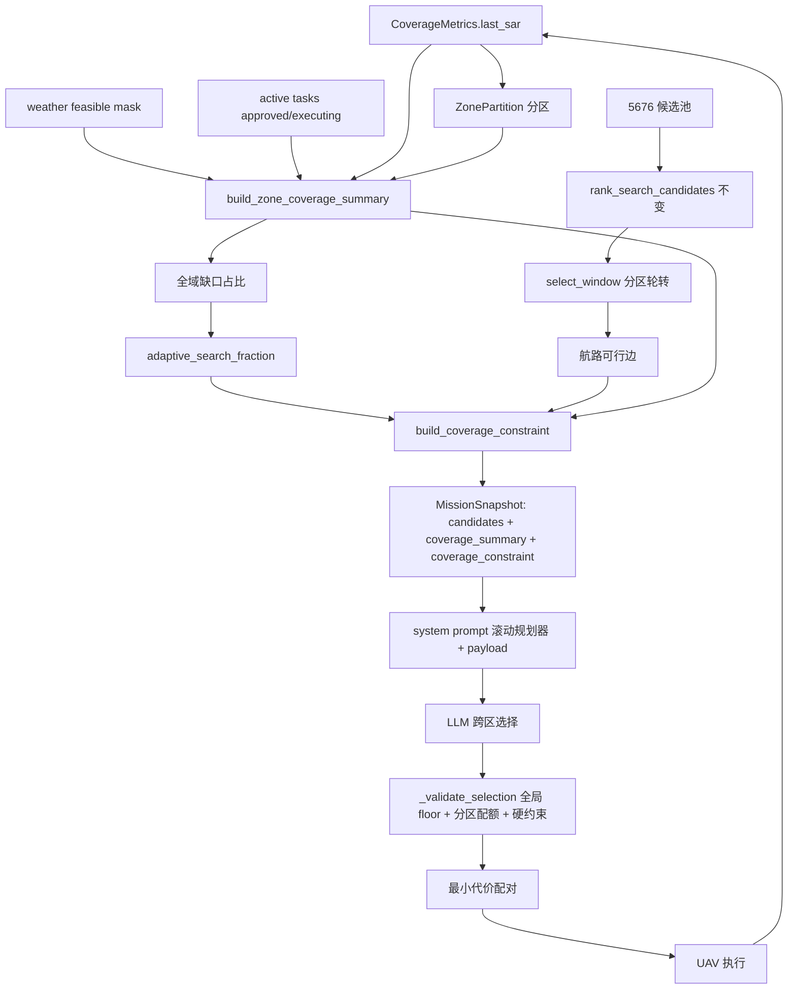

# 分区感知滚动覆盖规划设计（Zone-Aware Rolling Coverage Planning）

状态：待用户审阅。本文及配套实施方案不构成实施授权。

日期：2026-09-20。本文是数据与行为契约的唯一来源。前置方向已于 2026-09-20 由用户确认：分区摘要 + 空间分散排序 + 缺口自适应预算 + **分区配额硬约束**，实现路线选择 A（程序生成几何 + LLM 跨区选择 + 确定性配对）。

## 1. 目标、问题与边界

当前决策器是「在程序预生成的小矩形候选里挑几个」：提示词禁止 LLM 生成或修改矩形边界（`src/mission/prompts/mission_scheduler.txt`），候选池 5676 个矩形只给模型看约 25 个（6 核查 + 19 搜索），首轮实际选择 6 个 AIS 核查 + 4 个搜索块，全部 10 架占用后无空闲飞机覆盖其余区域；`min_search_uav_fraction=0.4` 只保证约 4 架「承担搜索任务」，不保证空间铺开，也不保证正在扫描。图上的四块是已分配任务，不是已扫描面积，也不是全域计划。此前修复（非法匹配、被动接触传递）没有把决策器改成全域规划器。

本设计把调度目标改为「**根据全域覆盖缺口滚动分配区域**」，同时保留航路、资源和抢占的硬约束：

1. 每轮决策载荷携带全域分区覆盖摘要（未扫 / 超期 / 在途）；
2. 候选窗口按分区空间分散选取代表；
3. 覆盖缺口大时提高搜索资源预算，避免首轮大多数飞机去核查；
4. 缺口分区配额作为硬约束由校验器强制执行（可行才要求，不可行降级并明示）；
5. 区域几何仍由程序生成与校验，LLM 只做跨分区选择；
6. 任务完成与信息变旧时滚动更新，复用现有 heavy 触发链路，不新增触发器。

### 非目标

- 不恢复「LLM 自由划 bbox」（路线 B 已否决）：几何生成与合法性校验仍全在程序侧。
- 不做确定性全覆盖规划器替换 LLM 选择链路（路线 C 已否决）。
- 不改变航路、资源、抢占、冷却、配对（Hungarian / 最小代价匹配）的现有语义。
- 不新增触发类型；覆盖恶化提前触发的可选增强不在本次范围。
- 不改变全局 search 下限的「已分配即计数」语义（转场中的搜索任务仍计入 `active_search_count`）；分区配额以「有效缺口」补偿该弱点（见 6.3）。

## 2. 已确认需求

| ID | 必须实现的行为 |
|---|---|
| R1 | 每轮决策载荷含全域分区覆盖摘要：每区未扫格数、超期格数、在途任务数与在途覆盖格数、有效缺口占比，以及全域聚合（未扫 / 超期 / 缺口百分比）。 |
| R2 | 候选窗口的普通搜索代表按分区轮转选取，使提示中候选天然分散到各区；urgent（核查 / 跟踪 / 被动）候选与轮转前行为一致。 |
| R3 | 搜索资源预算自适应：`fraction = min + (max − min) × 全域缺口占比`，缺口大（首轮 ≈ 1）时接近 max，覆盖改善后回落至 min。 |
| R4 | 分区配额硬约束：有效缺口超过阈值的分区按缺口降序获得 1 架配额，must-service 代表候选的矩形必须完整落在该分区内；单一最大匹配确定可行槽位，匹配不上的分区降级为不可行并携带 infeasible_reason；校验器强制满足。 |
| R5 | 在途搜索任务按 bbox 归属分区并计入该区「有效缺口」扣除，已由在途覆盖补足的分区不再获得配额。 |
| R6 | 滚动更新复用现有链路：任务完成 → heavy 事件 → 新决策；信息变旧 → 周期 heavy（`heavy_cycle_min`）兜底。每轮决策基于最新 `last_sar` 重算摘要、预算与配额。 |
| R7 | 兼容性：无 coverage metrics 的 legacy 路径行为与现在完全一致；`CoverageConstraint` 扩展向后兼容（新字段默认空）；既有回归测试保持全绿。 |
| R8 | README 第 2 章更新为真实架构（程序生成几何 + LLM 跨区选择 + 确定性配对），消除旧版「LLM 动态划区」与实际行为的差异。 |

## 3. 建议默认值（不冒充用户已决定）

| 项 | 默认 | 说明 |
|---|---|---|
| `zone_cols` / `zone_rows` | 3 / 3（9 区） | 30×30 网格下每区约 10×10 格，候选矩形（8–40 格、长宽比 ≤ 2:1）可完整落入区内。配置可调。 |
| `search_uav_fraction_min` | 0.4 | 沿用现有 `min_search_uav_fraction` 语义与配置名，作为下限。 |
| `search_uav_fraction_max` | 0.8 | 新增上限。 |
| `zone_quota_gap_threshold` | 0.5 | 有效缺口占比阈值，高于此值才获得配额。 |
| 配额强度 | 每缺口区 1 架，总数 ≤ healthy 架数 | 由单一最大匹配的可行槽位再收紧。 |
| 分区归属规则 | 配额代表要求**完整包含**；摘要与窗口轮转按 bbox 与各区 fixed 格重叠数最大归属，平局按 `zone_id` 升序 | 两条规则各自确定性、可测。 |
| 在途归属规则 | bbox 与分区 fixed 格有任意重叠即计入该区 | 保守，避免同一区重复派机。 |

用户可在审阅时修改；实现者不得把配额扩展成多层区划、时间窗细分、或新的确定性覆盖执行器。

## 4. 现有代码证据与改动点

| 当前位置 | 当前行为 | 新设计要求 |
|---|---|---|
| `src/schedule/candidate_extractor.py::extract_pool` | 枚举全部合法矩形（5676），无分区概念 | 池子本身不动；分区归属、配额代表在 policy 层计算。 |
| `src/mission/coverage_policy.py::rank_search_candidates` | 全局按（未扫优先、最旧超期、密度、尺寸、bbox）排序，无空间分散项 | 排序不动；分散在 `select_window` 轮转层实现。 |
| `src/mission/coverage_policy.py::select_window` | urgent 优先，ordinary reserve 全局取代表 | 增加可选 `zones` 参数按分区轮转；`zones=None` 时行为与现在逐字节一致。 |
| `src/mission/coverage_policy.py::build_coverage_constraint` | 固定 fraction=0.4，单一匹配，无分区概念 | fraction 由自适应函数计算后传入（函数独立可测）；增加可选 `zone_requirements` 输入与输出（默认空 → 行为不变），单一最大匹配内完成「配额优先、全局兜底」，避免两套匹配双重占用 UAV。 |
| `src/schedule/task_allocator.py::build_mission_snapshot` | 构建 prompt 窗口与全局 coverage constraint | 增加：分区摘要构建 → 自适应 fraction → 分区配额接线 → 快照新增 `coverage_summary` 字段。 |
| `src/mission/contracts.py::CoverageConstraint` | 仅全局字段 | 增加可选 `zone_requirements: tuple[ZoneCoverageRequirement, ...]`（默认空，向后兼容）。 |
| `src/mission/mission_scheduler.py::_validate_selection` | 只查全局 floor / must-service | 增加分区配额检查：每区 `required_search_count`、must-service 子集，报错码见 7。 |
| `src/mission/mission_scheduler.py::_prompt_payload` | 无全域覆盖视野 | 载荷增加 `coverage_summary`；100 KB 预算检查保留。 |
| `src/mission/prompts/mission_scheduler.txt` | 角色「选候选 ID」，无全域视野 | 角色改为「滚动全域覆盖规划器」；硬约束文本原样保留。 |
| `README.md` 第 2 章 | 旧版「LLM 动态划区」自由生成矩形 | 改为真实架构描述。 |

## 5. 架构与数据流



新增纯函数模块 `src/mission/coverage_zones.py`，无状态、可独立测试；policy 层（`coverage_policy.py`）负责排序、窗口、预算与配额构建；调度器与校验器只做接线与强制。

## 6. 数据与接口契约

### 6.1 分区（`ZonePartition`）

- 构造：`ZonePartition(fixed_mask, zone_cols, zone_rows)`；`zone_cols/zone_rows` 为正整数；分区按网格坐标均匀切块，末行 / 末列吸收余数。
- 暴露：`zone_ids`（按行列序升序）、`zone_bbox(zone_id)`、`zone_cells(zone_id)`（只含 fixed 格）、`zone_of_bbox(bbox)`（按 bbox 与各区 fixed 格重叠数最大归属，平局取 `zone_id` 升序）。
- 无 fixed 格的分区从摘要与配额中省略（如整块陆地的角落分区）。

### 6.2 分区摘要（`build_zone_coverage_summary`）

输入：`last_sar`、fixed、feasible（天气）、`now_min`、`primary_window_min`、在途任务（approved/executing、kind 为搜索、bbox 非空且 `assigned_uav_id` 非空——未配对任务不算在途，避免错误豁免分区配额）。

输出（JSON-ready）：

```json
{
  "schema_version": "zone-coverage-summary/v1",
  "as_of_min": 120.0,
  "zone_cols": 3, "zone_rows": 3,
  "gap_pct": 87.5, "unseen_pct": 80.0, "overdue_pct": 7.5,
  "zones": [
    {
      "zone_id": "zone:0:0", "bbox": [1, 1, 10, 10],
      "fixed_cells": 81, "searchable_cells": 81,
      "unseen_cells": 60, "overdue_cells": 10,
      "gap_fraction": 0.864,
      "effective_gap_fraction": 0.864,
      "in_flight_search_tasks": 0, "in_flight_cells": 0
    }
  ]
}
```

定义：

- `gap_fraction = (unseen + overdue) / fixed`；`overdue` 为 `last_sar ≤ now − primary_window_min` 的已扫格；`unseen` 为 `last_sar = −inf` 的格。
- **有效缺口**：扣除被在途任务 bbox 覆盖的格后重算 `effective_gap_fraction`，配额阈值作用于有效缺口（R5）。
- 全域聚合 `gap_pct / unseen_pct / overdue_pct` 与 `CoverageMetrics.snapshot` 的口径一致（`unseen_pct + overdue_seen_pct`），保证自适应预算与指标同源。
- `searchable_cells` 计入天气遮挡统计；摘要只描述现状，不修改任何任务或矩阵。

### 6.3 自适应搜索预算（`adaptive_search_fraction`）

```
gap = gap_pct / 100                # 0..1，无 fixed 格时视为 0
fraction = min + (max − min) × gap # 默认 0.4 + 0.4 × gap
```

单调、确定性；`min ≤ max` 由配置校验保证。随后沿用现有 `build_coverage_constraint` 语义：`desired = ceil(healthy × fraction)`，`outstanding = max(desired − active_search_count, 0)`，匹配不足时 `infeasible_reason` 与今天一致。

### 6.4 分区配额（并入 `build_coverage_constraint`）

- 新可选入参 `zone_requirements_input`：`Iterable[ZoneQuotaInput]`，每项 `{zone_id, candidate_task_ids}`（该区在 prompt 窗口内的搜索候选，矩形完整落在区内）。
- 配额构建（**同一**最大匹配内完成，避免两套匹配双重占用 UAV）：
  1. 缺口区（有效缺口 ≥ 阈值）按 `effective_gap_fraction` 降序（平局按 `zone_id` 升序）；
  2. 匹配访问顺序：先各缺口区代表候选，再全局 representatives——缺口区代表优先获得可行 UAV；
  3. 匹配上的缺口区进入 `zone_requirements` 输出：`required_search_count=1`、`representative_task_ids`（该区窗口内全部候选）、`must_service_task_ids`（匹配选中的代表）；
  4. 匹配不上 / 窗口内无候选的缺口区不进入输出（不要求），并计入 `zone_infeasible` 明细（audit 字段，不影响现有字段）；
  5. 配额区代表同时并入全局 `representative_task_ids`，选中的配额代表计入全局 `required_new_search_count` 计数（共享代表集，不产生双重约束冲突）。
- 输出契约：`CoverageConstraint` 新增

```python
zone_requirements: tuple[ZoneCoverageRequirement, ...] = ()
# ZoneCoverageRequirement: {zone_id, required_search_count, representative_task_ids, must_service_task_ids, infeasible_reason}
```

默认空 → 现有序列化与校验路径逐字节不变。

### 6.5 候选窗口分散（`select_window(..., zones=None)`）

- `zones` 为 `None`：行为与现在完全一致（legacy 兼容，R7）。
- `zones` 非空：urgent 候选照旧先取；ordinary reserve 代表改为**分区轮转**——第 1 轮每区（按 `zone_id` 升序）取区内排名最优且不与已选 bbox 重叠的代表，第 2 轮再补，直至 reserve 满；区内排序沿用现有 rank key；无合格候选的分区跳过。代表之外的非重叠填充逻辑不变。

### 6.6 快照与载荷

- `MissionSnapshot` 新增可选 `coverage_summary` 字段（无 metrics 时为 `None`）。
- `_prompt_payload` 将 `coverage_summary` 原样放入 `snapshot`；9 区摘要约 1–2 KB，受既有 100 KB 预算检查保护（预算测试见 9）。

## 7. 校验与降级

- 校验器新增错误码（仅在分区 `infeasible_reason is None` 时强制，与现有全局 floor 的 `floor_infeasible` 容忍语义一致）：
  - 该区 `selected ∩ representative_task_ids` 数量 < `required_search_count` → `zone_quota_not_met:{zone_id}`；
  - `must_service_task_ids` 未被全部选中 → `zone_must_service_not_selected:{zone_id}`。
- 降级路径（全部确定性、可审计）：
  1. 分区无 fixed 格 → 摘要省略，配额跳过；
  2. 窗口内无该区合格候选或最大匹配不可行 → 该区不进入 `zone_requirements`，记 `zone_infeasible`；
  3. 全局 floor 不可行 → 沿用现有 `infeasible_reason`，模型可合法 defer；
  4. LLM 违反任一硬约束 → 现有 gateway 重试 / 校验失败链路不变。
- 配额代表必须对模型可见：配额候选取自 prompt 窗口任务，窗口即 `visible_task_ids` 来源，因此不会出现「要求选一个没给模型看的任务」。

## 8. 错误处理

- 配置非法（分区数非正、`max < min`、阈值越界）→ `CoverageConfig.__post_init__` 启动报错，沿用现有风格。
- legacy 路径（`coverage_metrics` 不存在）→ 摘要为 `None`、无配额、fraction 取 min，行为与现在一致。
- `zone_of_bbox` 无法归属（bbox 与所有分区无 fixed 重叠）→ 返回 `None`，轮转跳过；该情况在 coverage_context 路径下不应出现（池候选只含 fixed 格），测试覆盖防御性分支。
- 时间倒退 / 矩阵形状不符 → 沿用 `CoveragePolicy` / `CoverageMetrics` 现有校验错误。

## 9. 测试

新增（全部确定性，不调真实 LLM）：

| 套件 | 覆盖 |
|---|---|
| `test_coverage_zones.py` | 分区穷尽不变式（每个 fixed 格恰好属于一个分区；无 fixed 分区省略）、bbox 归属确定性（最大重叠 + 平局）、完整包含判定、配置校验。 |
| `test_coverage_zone_summary.py` | 未扫 / 超期 / 在途归属与扣除（R1、R5）、有效缺口、全域聚合与 `CoverageMetrics.snapshot` 同源、天气遮挡统计。 |
| `test_coverage_budget.py`（并入 policy 测试） | 自适应 fraction 单调、端点（gap=0 → min，gap=1 → max）、无 fixed 格 → min（R3）。 |
| `test_coverage_zone_quota.py` | 缺口区排序与阈值、配额代表必须完整在区内、单一匹配优先级、匹配不足降级与 `zone_infeasible`、默认空参数向后兼容（R4）。 |
| `test_mission_scheduler.py` 扩展 | 校验器：配额不满足 → `zone_quota_not_met`；must-service 未选 → `zone_must_service_not_selected`；infeasible 区容忍；满足即通过（R4）。 |
| `test_coverage_prompt_window.py` 扩展 | `zones` 轮转分散（各分区均有代表）；`zones=None` 与现状逐字节一致（R2、R7）。 |
| `test_task_allocator` / 快照测试 | `coverage_summary` 在 metrics 路径存在、legacy 路径为 `None`；载荷 100 KB 预算上限在最坏分区数下仍满足。 |

回归（沿用用户指定回归验证）：

- 基线已核实全绿：coverage 相关 72（policy / prompt_window / decision_budget / metrics / service）+ 调度与回归 48（mission_scheduler + regressions）+ 其余 coverage 集成 33。
- 端到端验收场景：
  1. 首轮 gap≈1：fraction=0.8 → `required_new_search_count` 要求 8 架搜索；9 区配额按缺口降序 must-service（受匹配可行性限制）；「6 核查 + 4 搜索」选择被校验器拒绝，分散选择通过；
  2. 部分区完成滚动：完成事件触发 heavy，该区格子转 fresh，摘要缺口下降，预算回落，配额迁移到剩余缺口区；
  3. 在途覆盖扣除：某区已有在途任务覆盖缺口 → `effective_gap_fraction` 降至阈值以下 → 该区不再获得配额。

## 10. 实施顺序与需求追踪

| 步骤 | 内容 | 对应需求 |
|---|---|---|
| T00 | 证据与基线：运行回归套件记录基线（已完成，153 绿）；核对该设计引用的文件行号。 | R7 |
| T01 | `coverage_zones.py`：`ZonePartition` + `build_zone_coverage_summary`，配单元测试。 | R1 |
| T02 | `adaptive_search_fraction` 进 `coverage_policy.py`，配测试；`build_coverage_constraint` 扩展 `zone_requirements` 入出参（默认空向后兼容）。 | R3、R4 |
| T03 | `contracts.py`：`CoverageConstraint.zone_requirements` + `ZoneCoverageRequirement`，序列化兼容测试。 | R4 |
| T04 | `select_window` 增加 `zones` 轮转，配测试；`zones=None` 回归。 | R2 |
| T05 | `task_allocator.build_mission_snapshot` 接线：摘要 → 自适应 fraction → 配额输入 → 快照新字段。 | R1、R3、R4、R5 |
| T06 | `mission_scheduler`：`_prompt_payload` 载荷字段 + `_validate_selection` 分区配额检查，配测试。 | R4 |
| T07 | `mission_scheduler.txt` 角色改写（硬约束保留）+ README 第 2 章更新。 | R8 |
| T08 | 全量回归 + 端到端验收场景（9 节三项），修复任何回归。 | R6、R7 |

## 11. 用户审阅重点

1. 分区粒度默认 3×3（9 区）是否合适（配置可调）。
2. 配额强度「每缺口区 1 架、完整包含」是否可接受。
3. 自适应预算线性 0.4–0.8 的形状是否可接受。
4. 全局 search 下限「已分配即计数」语义保留、由有效缺口补偿——是否需要更激进的「转场不计入」。
5. README 改写为真实架构而非恢复自由划区——是否同意该措辞方向。
